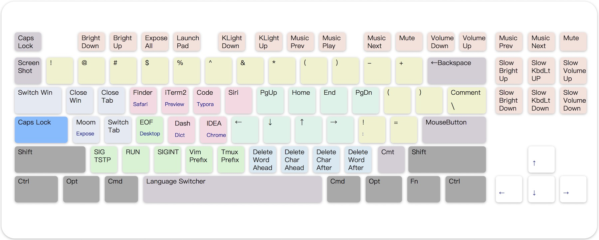
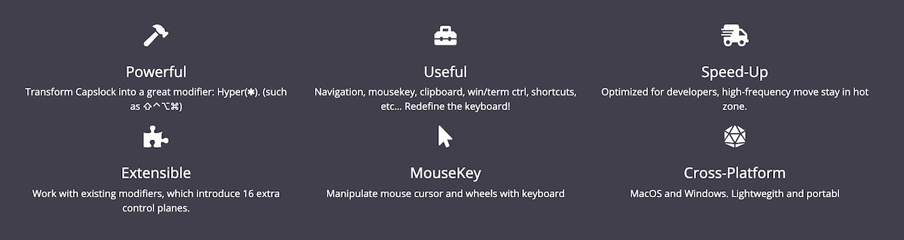
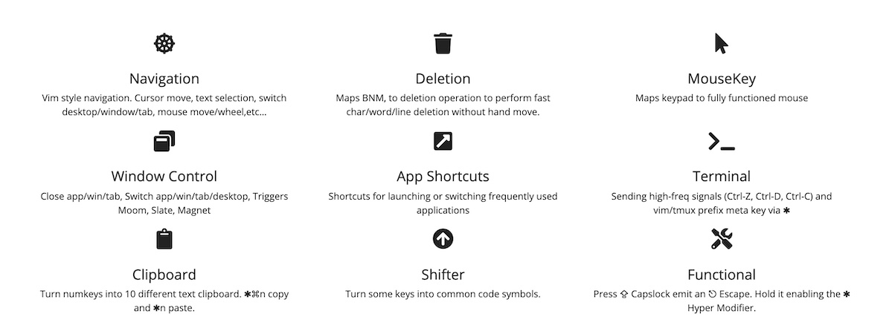
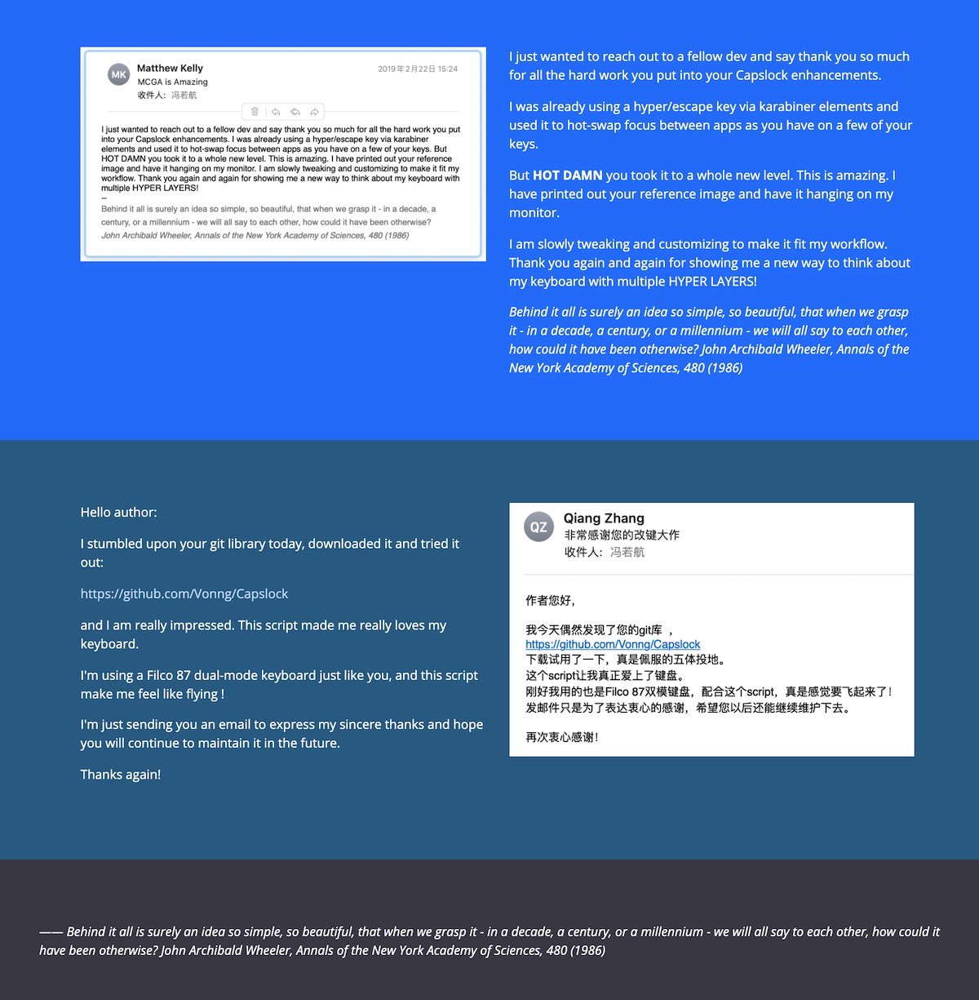

# CapsLock

> *Make CapsLock Great Again!*

[Karabiner Gallery](https://ke-complex-modifications.pqrs.org/#caps_lock_enhancement) | [GitHub Repo](https://github.com/Vonng/Capslock) | [Import URL](karabiner://karabiner/assets/complex_modifications/import?url=https://raw.githubusercontent.com/Vonng/Capslock/master/mac_v3/capslock.json)

------------------------

## CapsLock Enhancement Mac v3

*Transform <kbd>⇪</kbd>CapsLock into a powerful **modifier** **<kbd>✱</kbd> Hyper** that miraculously increases your work productivity!*

> [Control Plane](#control-planes) 0 Layout (There are 15 more!)

------------------------

## Highlights

* **Powerful**: Transform Capslock into a great modifier: **Hyper(<kbd>✱</kbd>)**. (such as <kbd>⇧</kbd><kbd>⌃</kbd><kbd>⌥</kbd><kbd>⌘</kbd>)
* **Useful**: Navigation, mousekey, clipboard, win/term ctrl, shortcuts, etc... **Redefine the keyboard!**
* **Speed-Up**: Optimized for developers, high-frequency move **stay in hot zone**.
* **Extensible**: Work with existing modifiers, which introduce **16 extra control planes**.
* **MouseKey**: Manipulate mouse cursor and wheels with keyboard
* **Cross-Platform**: macOS and Windows. Light-Weight and portable

------------------------

## Features

- [Basic](#Basic)               : Press <kbd>⇪</kbd> Capslock emit an **<kbd>⎋</kbd> Escape**. Hold it enabling the **<kbd>✱</kbd> Hyper Modifier**.
- [Navigation](#Navigation)     : Vim style navigation. Cursor move, text selection, switch desktop/window/tab, mouse move/wheel,etc...
- [Deletion](#Deletion)         : Maps `BNM,` to deletion operation to perform fast char/word/line deletion without hand move.
- [MouseKey](#MouseKey)         : Maps keypad to fully functional mouse
- [Window](#window-control)     : Close app/win/tab, Switch app/win/tab/desktop, integration with win-manager app such as Moom,Slate,Magnet
- [Application](#app-shortcuts) : Shortcuts for launching or switching frequently used applications
- [Terminal](#terminal-control) : Sending high-freq signals (Ctrl-Z, Ctrl-D, Ctrl-C) and vim/tmux prefix meta key via  <kbd>✱</kbd>
- [Clipboard](#Clipboard)       : Turn numkeys into 10 different text clipboards. <kbd>✱</kbd><kbd>⌘</kbd>n copy and <kbd>✱</kbd>n paste.
- [Shifter](#Shifter)           : Turn some keys into common code symbols.
- [Functional](#Functional)     : Screenshots. Fine-grained light/volume control. Take function keys' function back!

------------------------

## Install

It only takes two steps to enable Capslock on your Mac: Download & Enable

1. [Download](https://github.com/pqrs-org/Karabiner-Elements/releases/download/v14.2.0/Karabiner-Elements-14.2.0.dmg)

   Download & Install [**Karabiner-Elements**](https://karabiner-elements.pqrs.org/).

   Follow the wizard and grant required permissions (Settings - Security - Privacy)

2. [Enable](karabiner://karabiner/assets/complex_modifications/import?url=https://ke-complex-modifications.pqrs.org/json/caps_lock_enhancement.json)

   Open this [link](karabiner://karabiner/assets/complex_modifications/import?url=https://raw.githubusercontent.com/Vonng/Capslock/master/mac_v3/capslock.json) with Safari. It will launch Karabiner-Elements and load configuration.

   `karabiner://karabiner/assets/complex_modifications/import?url=https://raw.githubusercontent.com/Vonng/Capslock/master/mac_v3/capslock.json`

   > #### Alternative Links
   > * [Karabiner Gallery](karabiner://karabiner/assets/complex_modifications/import?url=https://ke-complex-modifications.pqrs.org/json/caps_lock_enhancement.json)：https://ke-complex-modifications.pqrs.org/json/caps_lock_enhancement.json
   > * [GitHub Repo](karabiner://karabiner/assets/complex_modifications/import?url=https://raw.githubusercontent.com/Vonng/Capslock/master/mac_v3/capslock.json)： https://raw.githubusercontent.com/Vonng/Capslock/master/mac_v3/capslock.json
   > * [Capslock Website](karabiner://karabiner/assets/complex_modifications/import?url=https://vonng.com/capslock.json)： https://vonng.com/capslock.json
   > * Or download [**capslock.json**](mac_v3/capslock.json) to ` ~/.config/karabiner/assets/complex_modifications/` manually.

   Click `Enable All` for `Capslock Enhancement` on pop-up dialog. It will affect immediately.

   You can now try moving the cursor with ⇪ + h,j,k,l, And exploring more features below.

------------------------

## Usage

Capslock works on **ANSI** keyboards and similar layouts. It literally remaps every [**keys**](#Symbols) on the keyboard. Including 10 categories.

> **[Control Planes](#Control-Planes)** are defined by combination of four extra left modifiers: <kbd>⌘</kbd><kbd>⌥</kbd><kbd>⌃</kbd><kbd>⇧</kbd>.This image shows the layout of control plane 0.

|           Category            | Color  | Description                                                                                                          |
|:-----------------------------:|:------:|:---------------------------------------------------------------------------------------------------------------------|
|        [Basic](#Basic)        |  Blue  | Press <kbd>⇪</kbd> Capslock  emit an  **<kbd>⎋</kbd> Escape**. Hold it enabling the **<kbd>✱</kbd> Hyper Modifier**. |
|   [Navigation](#Navigation)   |  Pink  | Vim style navigation. Cursor move, text selection, switch desktop/window/tab, mouse move/wheel,etc...                |
|     [Deletion](#Deletion)     | Brown  | Maps `BNM,` to deletion operation to perform fast char/word/line deletion without hand move.                         |
|     [MouseKey](#MouseKey)     | Keypad | Maps keypad to fully functional mouse                                                                                |
|   [Window](#window-control)   | Azure  | Close app/win/tab, Switch app/win/tab/desktop, integration with win-manager app such as Moom,Slate,Magnet            |
| [Application](#app-shortcuts) | Yellow | Shortcuts for launching or switching frequently used applications                                                    |
| [Terminal](#terminal-control) | Green  | Sending high-freq signals (Ctrl-Z, Ctrl-D, Ctrl-C) and vim/tmux prefix meta key via  <kbd>✱</kbd>                    |
|    [Clipboard](#Clipboard)    | Purple | Turn numkeys into 10 different text clipboard. <kbd>✱</kbd><kbd>⌘</kbd>n copy and <kbd>✱</kbd>n paste.               |
|      [Shifter](#Shifter)      | Orange | Turn some keys into common code symbols.                                                                             |
|   [Functional](#Functional)   |  Cyan  | Screenshtots. Fine-grained light/volume control. Take function keys' function back!                                  |

### Basic

|           Key            |          MapsTo          | Comment                                     |
|:------------------------:|:------------------------:|---------------------------------------------|
|    <kbd>⇪</kbd> Press    |   <kbd>⎋</kbd> Escape    | Click Capslock to emit Escape               |
|    <kbd>⇪</kbd> Hold     |   <kbd>✱</kbd>  Hyper    | Hold Capslock to enable **Hyper** modifier. |
| <kbd>✱</kbd><kbd>⎋</kbd> |  <kbd>⇪</kbd> Capslock   | Press to switch Capslock status             |
| <kbd>✱</kbd><kbd>␣</kbd> | <kbd>⌃</kbd><kbd>␣</kbd> | Switch input source, +<kbd>⌘</kbd> to emoji |

> Note that <kbd>✱</kbd> is implemented as the combination of **ALL RIGHT MODIFIERS**: <kbd>⌘</kbd><kbd>⌥</kbd><kbd>⌃</kbd><kbd>⇧</kbd>.
>
> Hold **<kbd>✱</kbd> Hyper** to enable hyper functionalities. We will assume and omit that in subsequent document.

### Navigation

* <kbd>H</kbd>, <kbd>J</kbd>, <kbd>K</kbd>, <kbd>L</kbd>, <kbd>U</kbd>, <kbd>I</kbd>, <kbd>O</kbd>, <kbd>P</kbd> are used as **Navigators**. Maps to <kbd>←</kbd><kbd>↓</kbd><kbd>↑</kbd><kbd>→</kbd><kbd>⇞</kbd><kbd>↖</kbd><kbd>↘</kbd><kbd>⇟</kbd> by default. (pink area).
* 9 control planes have already been allocated for navigators.
* Hold additional <kbd>⌘</kbd> Command for **selection**.  (like holding <kbd>⇧</kbd>shift in normal), additional <kbd>⌥</kbd> Option for **word/para selection**.
* Hold additional <kbd>⇧</kbd> Shift for **app/win/tab switching**.  Hold additional <kbd>⌃</kbd> Control for **desktop management**.
* Hold the additional <kbd>⌥</kbd> Option for 🖱️ **mouse move**.  Add <kbd>⇧</kbd>shift to **⏫ accelerate**.  (<kbd>U</kbd>, <kbd>I</kbd>, <kbd>O</kbd>, <kbd>P</kbd> maps to mouse buttons).
* <kbd>⇧</kbd><kbd>⌥</kbd> turns navigator to **🖲️ mouse wheel**, and <kbd>⇧</kbd><kbd>⌘</kbd> is the ⏫ **accelerated** version .  `HJKL` for wheel, while `UIOP` for reversed wheel move.

|   Feature    |   **Move**   |  **Select**  |       **WordSel**        |  **Window**  | **Desktop**  |     🖱️      |         **🖱️⏫**         |           🖲️            |           🖲️⏫           |
|:------------:|:------------:|:------------:|:------------------------:|:------------:|:------------:|:------------:|:------------------------:|:------------------------:|:------------------------:|
|   Key\Mod    | <kbd>✱</kbd> | <kbd>⌘</kbd> | <kbd>⌘</kbd><kbd>⌥</kbd> | <kbd>⇧</kbd> | <kbd>⌃</kbd> | <kbd>⌥</kbd> | <kbd>⇧</kbd><kbd>⌥</kbd> | <kbd>⇧</kbd><kbd>⌃</kbd> | <kbd>⇧</kbd><kbd>⌘</kbd> |
| <kbd>H</kbd> |     Left     |  word left   |        word left         |   prev tab   |  prev desk   |      ⬅️      |           ⬅️⏫            |            ⬅️            |           ⬅️⏫            |
| <kbd>J</kbd> |     Down     |  line down   |       3 line down        |   next app   |    focus     |      ⬇️      |           ⬇️⏫            |            ⬇️            |           ⬇️⏫            |
| <kbd>K</kbd> |      Up      |   line up    |        3 line up         |   prev app   |  expose all  |      ⬆️      |           ⬆️⏫            |            ⬆️            |           ⬆️⏫            |
| <kbd>L</kbd> |    Right     |  word right  |        word right        |   next tab   |  next desk   |      ➡️      |           ➡️⏫            |            ➡️            |           ➡️⏫            |
| <kbd>U</kbd> |     PgUp     |  prev page   |        prev page         |    zoom-     |  fullscreen  |     🖱️L     |           🖱️L           |            ➡️            |           ➡️⏫            |
| <kbd>I</kbd> |     Home     |  line head   |         end2head         |   prev win   |     hide     |     🖱️R     |           🖱️R           |            ⬆️            |           ⬆️⏫            |
| <kbd>O</kbd> |     End      |   line end   |         head2end         |   next win   |   hide all   |     🖱️B     |           🖱️B           |            ⬇️            |           ⬇️⏫            |
| <kbd>P</kbd> |     PgDn     |  next page   |        next page         |    zoom+     |  Launchpad   |     🖱️F     |           🖱️F           |            ⬅️            |           ⬅️⏫            |

**Arrow Navigation**

* Arrows <kbd>←</kbd>↓<kbd>↑</kbd>→ to 🖱️ **mouse** actions too. Hold <kbd>⌥</kbd> Option to ⏬ **slow down**, hold <kbd>⌘</kbd> Command to ⏫ **speed up**.
* Hold <kbd>⇧</kbd> Shift turns to 🖲️ **wheel move**.  Extra <kbd>⌥</kbd> Option to ⏬ **slow down**, extra <kbd>⌘</kbd> Command to ⏫ **speed up**.
* <kbd>↩</kbd> Return maps to left-**click**.  And additional <kbd>⌘</kbd><kbd>⌥</kbd><kbd>⌃</kbd><kbd>⇧</kbd> turns into right click, middle-click, backward, forward.

|                     Feature                      |     🖱️      |     🖱️⏬     |     🖱️⏫     |     🖲️      |           🖲️⏬           |           🖲️⏫           |
|:------------------------------------------------:|:------------:|:------------:|:------------:|:------------:|:------------------------:|:------------------------:|
|                   **Key\Mod**                    | <kbd>✱</kbd> | <kbd>⌥</kbd> | <kbd>⌘</kbd> | <kbd>⇧</kbd> | <kbd>⇧</kbd><kbd>⌥</kbd> | <kbd>⇧</kbd><kbd>⌘</kbd> |
| <kbd>←</kbd><kbd>↓</kbd><kbd>↑</kbd><kbd>→</kbd> | speed = 1600 |  speed ÷ 2   |  speed × 2   |  speed = 32  |        speed ÷ 2         |        speed × 2         |
|                   <kbd>↩</kbd>                   |     🖱️L     |     🖱️M     |     🖱️R     |     🖱️L     |           🖱️B           |           🖱️F           |

### Deletion

<kbd>N</kbd> <kbd>M</kbd> <kbd>,</kbd> <kbd>.</kbd> are used as **Deletor keys**. Right below the navigators for fast access (brown area).

|   Key\Mod    |   <kbd>✱</kbd>   |    <kbd>⌘</kbd>    |    <kbd>⌥</kbd>    |
|:------------:|:----------------:|:------------------:|:------------------:|
| <kbd>N</kbd> | del a word ahead | del till line head | del the whole line |
| <kbd>M</kbd> | del a char ahead |  del a word ahead  |  move line below   |
| <kbd>,</kbd> | del a char after |  del a word after  |  move line above   |
| <kbd>.</kbd> | del a word after | del till line end  | del the whole line |
| <kbd>⌫</kbd> |     del file     |     purge file     |                    |

### MouseKey

* Turn **Keypad** into a fully funcional 🖱️ **mouse**.
* Numbers maps to 8 direction 🖱️ **mouse move**. Hold <kbd>⌥</kbd> Option to ⏬ **slow down**, hold <kbd>⌘</kbd> Command to ⏫ **speed up**.
* Hold additional <kbd>⇧</kbd> Shift turns to 🖲️ **wheel move**.  Extra <kbd>⌥</kbd> Option to ⏬ **slow down**, and extra <kbd>⌘</kbd> Command to ⏫ **speed up**.
* First line maps to wheel move and <kbd>0</kbd>, <kbd>.</kbd>, <kbd>⌤</kbd>, <kbd>+</kbd>, <kbd>-</kbd> maps to five mouse buttons.

| <kbd>⇭</kbd>  🖲️⬅️ | <kbd>=</kbd> 🖲️⬇️ | <kbd>/</kbd>  🖲️⬆️ | <kbd>*</kbd>  🖲️➡️ |
|:-------------------:|:------------------:|:-------------------:|:-------------------:|
| <kbd>7</kbd>🖱️ ↖️  | <kbd>8</kbd> 🖱️⬆️ | <kbd>9</kbd> 🖱️↗️  |  <kbd>-</kbd> 🖱️B  |
| <kbd>4</kbd>🖱️ ⬅️  |  <kbd>5</kbd>🖱️   | <kbd>6</kbd> 🖱️➡️  |  <kbd>+</kbd> 🖱️F  |
|  <kbd>1</kbd>🖱️↙️  | <kbd>2</kbd> 🖱️⬇️ | <kbd>3</kbd> 🖱️↘️  |                     |
|  <kbd>0</kbd> 🖱️L  |                    |  <kbd>.</kbd> 🖱️M  |  <kbd>⌤</kbd> 🖱️R  |

### Window Control

* `Tab`, <kbd>Q</kbd>, <kbd>W</kbd>, <kbd>A</kbd>, <kbd>s</kbd> used as window control keys. Focusing on close/switch applications / windows / tabs / desktops. (azure area)
* Windows management (resize, layout) leaves to external application such as [Moom](https://manytricks.com/moom/), [Magnet](https://apps.apple.com/us/app/magnet/id441258766), and [Slate](https://github.com/jigish/slate). Bind <kbd>⌃</kbd><kbd>⌥</kbd><kbd>⇧</kbd><kbd>⌘</kbd>A manually.

|   Key\Mod    | <kbd>✱</kbd> | <kbd>⌘</kbd>  |  <kbd>⌥</kbd>  | <kbd>⌃</kbd>  | <kbd>⇧</kbd> |
|:------------:|:------------:|:-------------:|:--------------:|:-------------:|:------------:|
| <kbd>⇥</kbd> |   next app   |   prev app    | switch desktop |               |  switch tab  |
| <kbd>Q</kbd> |  close app   |   close app   |                |  Lock Screen  |    Logout    |
| <kbd>W</kbd> |  close tab   | close all win |                | Display Sleep |    Sleep     |
| <kbd>A</kbd> | **win app**  |  expose all   |  show desktop  |   LaunchPad   |              |
| <kbd>S</kbd> |   next tab   |   prev tab    |    next win    |   prev win    |              |

### App Shortcuts

* <kbd>E</kbd> <kbd>R</kbd> <kbd>T</kbd> <kbd>Y</kbd> <kbd>F</kbd> <kbd>G</kbd> are used as application shortcuts. (yellow area)
* Popular apps and dev tools are registered to 3 default planes: <kbd>✱</kbd>/<kbd>⌘</kbd>/<kbd>⌥</kbd>. Assign these shortcuts according to your own needs.

|   Key\Mod    |    <kbd>✱</kbd>    | <kbd>⌘</kbd> | <kbd>⌥</kbd> |
|:------------:|:------------------:|:------------:|:------------:|
| <kbd>E</kbd> |       Safari       |    Finder    |     Mail     |
| <kbd>R</kbd> |       iTerm2       |   Preview    |   Terminal   |
| <kbd>T</kbd> | Visual Studio Code |    Typora    |     Note     |
| <kbd>Y</kbd> |        Siri        |  Karabiner   | Amphetamine  |
| <kbd>F</kbd> |      Alfred 4      |     Dash     |  Dictionary  |
| <kbd>G</kbd> |   Intellij IDEA    |    Chrome    |   Calender   |

### Terminal Control

<kbd>D</kbd>, <kbd>Z</kbd>, <kbd>X</kbd>, <kbd>C</kbd>, <kbd>V</kbd>, <kbd>B</kbd> are used as terminal control keys. Sending singals and IDE commands. (green area)

|   Key\Mod    |                              <kbd>✱</kbd>                              |               <kbd>⌘</kbd>               |
|:------------:|:----------------------------------------------------------------------:|:----------------------------------------:|
| <kbd>D</kbd> |               <kbd>⌃</kbd><kbd>D</kbd> Ctrl+D (Send EOF)               |           Define (Force touch)           |
| <kbd>Z</kbd> |               <kbd>⌃</kbd><kbd>Z</kbd> Ctrl+Z  (SIGTSTP)               |      <kbd>F5</kbd> (VS Code Debug)       |
| <kbd>X</kbd> |               <kbd>⌃</kbd><kbd>R</kbd> Ctrl+R (IDE Run)                | <kbd>⌃</kbd><kbd>F5</kbd> (VS Code Run)  |
| <kbd>C</kbd> |               <kbd>⌃</kbd><kbd>C</kbd>  Ctrl+C (SIGINT)                | <kbd>⇧</kbd><kbd>>F5</kbd>（VS Code Stop） |
| <kbd>V</kbd> |              <kbd>⌃</kbd><kbd>V</kbd>Ctrl+V (Vim Prefix)               |                                          |
| <kbd>B</kbd> | <kbd>⌃</kbd><kbd>B</kbd>Ctrl+B ([Tmux](http://tmux.github.io)  Prefix) |                                          |

### Clipboard

Number keys <kbd>1</kbd>, <kbd>2</kbd>, …, <kbd>9</kbd>, <kbd>0</kbd> are used as **(text) clipboard**. Hold <kbd>⌘</kbd> to **copy**, and press to **paste**. (purple area)

|   Key\Mod    |   <kbd>✱</kbd>    |  <kbd>⌘</kbd>   |
|:------------:|:-----------------:|:---------------:|
| <kbd>1</kbd> | Paste from clip 1 | Copy to clip 1  |
| <kbd>2</kbd> | Paste from clip 2 | Copy to clip 2  |
|      ……      |        ……         |       ……        |
| <kbd>0</kbd> | Paste from clip 0 | Copy to clip 10 |

### Shifter

* Trivial transformation for misc characters. (orange area)
* Some special tricks for developers. Such as `;'` maps to `:=` or `!=` (<kbd>⌘</kbd>)

|    Key\Mod    |       <kbd>✱</kbd>       | <kbd>⌘</kbd> | <kbd>⌥</kbd> |
|:-------------:|:------------------------:|:------------:|:------------:|
| <kbd>-</kbd>  |       <kbd>_</kbd>       |   Zoom Out   |              |
| <kbd>=</kbd>  |       <kbd>+</kbd>       |   Zoom In    |              |
| <kbd>[</kbd>  |       <kbd>(</kbd>       | <kbd>{</kbd> | <kbd><</kbd> |
| <kbd>]</kbd>  |       <kbd>)</kbd>       | <kbd>}</kbd> | <kbd>></kbd> |
| <kbd>;</kbd>  |       <kbd>!</kbd>       | <kbd>:</kbd> |              |
| <kbd>'</kbd>  |       <kbd>=</kbd>       | <kbd>=</kbd> |              |
| <kbd>/</kbd>  | <kbd>⌘</kbd><kbd>/</kbd> |              |              |
| <kbd>\\</kbd> | <kbd>⌘</kbd><kbd>/</kbd> |              |              |

### Functional

- Use F1,…F12 as standard functional keys, while hold **<kbd>✱</kbd> Hyper** to turn them back. (cyan area)
- <kbd>⌘</kbd>Command + F1 / F2 / F3 is used as desktop switcher. Enable shortcuts in system preference first:

  **Preference** → **Keyboard** → **Shortcuts** → **MissionControl** → Switch to Desktop 1/2/3
- If you are using RMBP with Bar, consider changing your bar back to function keys with:

  **Karabiner-Elements** → **Function Keys** → **Use all F1, F2, etc. keys as standard function keys**

|       Key\Mod       |                             <kbd>✱</kbd>                              |             <kbd>⌘</kbd>             | Comment                                         |
|:-------------------:|:---------------------------------------------------------------------:|:------------------------------------:|-------------------------------------------------|
|    <kbd>`</kbd>     |           <kbd>⌃</kbd><kbd>⇧</kbd><kbd>⌘</kbd><kbd>4</kbd>            | <kbd>⇧</kbd><kbd>⌘</kbd><kbd>4</kbd> | Area selection screenshot(<kbd>⌘</kbd> to file) |
|    <kbd>F1</kbd>    | <kbd>display_brightness_decrement</kbd>  \|  <kbd>⌃</kbd><kbd>1</kbd> |       <kbd>⌃</kbd><kbd>1</kbd>       | Brightness Down / Desktop 1                     |
|    <kbd>F2</kbd>    |  <kbd>display_brightness_increment</kbd> \| <kbd>⌃</kbd><kbd>2</kbd>  |       <kbd>⌃</kbd><kbd>2</kbd>       | Brightness Up / Desktop 2                       |
|    <kbd>F3</kbd>    |        <kbd>⌃</kbd><kbd>↑</kbd>  \|  <kbd>⌃</kbd><kbd>3</kbd>         |       <kbd>⌃</kbd><kbd>3</kbd>       | Expose All / Desktop 3                          |
|    <kbd>F4</kbd>    |                         <kbd>Launchpad</kbd>                          |                                      | Launchpad                                       |
|    <kbd>F5</kbd>    |                   <kbd>illumination_decrement</kbd>                   |                                      | Keyboard Light Down                             |
|    <kbd>F6</kbd>    |                   <kbd>illumination_increment</kbd>                   |                                      | Keyboard Light Up                               |
|    <kbd>F7</kbd>    |                           <kbd>rewind</kbd>                           |                                      | Music Prev                                      |
|    <kbd>F8</kbd>    |                       <kbd>play_or_pause</kbd>                        |                                      | Play / Pause                                    |
|    <kbd>F9</kbd>    |                        <kbd>fastforward</kbd>                         |                                      | Music Next                                      |
|   <kbd>F10</kbd>    |                            <kbd>mute</kbd>                            |                                      | Mute                                            |
|   <kbd>F11</kbd>    |                      <kbd>volume_decrement</kbd>                      |                                      | Volume Down                                     |
|   <kbd>F12</kbd>    |                      <kbd>volume_increment</kbd>                      |                                      | Volume Up                                       |
|   <kbd>F13</kbd>    |           <kbd>⌃</kbd><kbd>⇧</kbd><kbd>⌘</kbd><kbd>3</kbd>            | <kbd>⇧</kbd><kbd>⌘</kbd><kbd>3</kbd> | Full Screentshot (<kbd>⌘</kbd> to file)         |
|   <kbd>F14</kbd>    |                 <kbd>⇧</kbd><kbd>⌘</kbd><kbd>5</kbd>                  | <kbd>⇧</kbd><kbd>⌘</kbd><kbd>6</kbd> | Screenshot menu (<kbd>⌘</kbd> touchbar snap)    |
|   <kbd>F15</kbd>    |                       <kbd>play_or_pause</kbd>                        |                                      | Play / Pause                                    |
|  <kbd>Insert</kbd>  |   <kbd>⇧</kbd><kbd>⌥</kbd> <kbd>display_brightness_increment</kbd>    |                                      | Fine-Grained Brightness Up                      |
| Delete <kbd>⌦</kbd> |   <kbd>⇧</kbd><kbd>⌥</kbd> <kbd>display_brightness_decrement</kbd>    |                                      | Fine-Grained Brightness Down                    |
|  Home <kbd>↖</kbd>  |      <kbd>⇧</kbd><kbd>⌥</kbd> <kbd>illumination_increment</kbd>       |                                      | Fine-GrainedKeyboard Light Up                   |
|  End <kbd>↘</kbd>   |      <kbd>⇧</kbd><kbd>⌥</kbd> <kbd>illumination_decrement</kbd>       |                                      | Fine-Grained Keyboard Light Down                |
|  PgUp <kbd>⇞</kbd>  |         <kbd>⇧</kbd><kbd>⌥</kbd> <kbd>volume_increment</kbd>          |                                      | Fine-Grained Volume Up                          |
|  PgDn <kbd>⇟</kbd>  |         <kbd>⇧</kbd><kbd>⌥</kbd> <kbd>volume_decrement</kbd>          |                                      | Fine-Grained Volume Down                        |

------------------------

## References

### Symbols

|                      Glyph                       |             Name             |          Glyph           |           Name           |
|:------------------------------------------------:|:----------------------------:|:------------------------:|:------------------------:|
|                   <kbd>⇪</kbd>                   |           Capslock           |       <kbd>✱</kbd>       |          Hyper           |
|                   <kbd>⎋</kbd>                   |            Escape            |       <kbd>␣</kbd>       |          Space           |
|                   <kbd>⌘</kbd>                   |        Command (Mac)         |       <kbd>⎇</kbd>       |       Alter (Win)        |
|                   <kbd>⌥</kbd>                   |         Option (Mac)         |       <kbd>⊞</kbd>       |        Win (Win)         |
|                   <kbd>⌃</kbd>                   |           Control            |       <kbd>⇧</kbd>       |          Shift           |
|                   <kbd>↩</kbd>                   |            Return            |       <kbd>⌤</kbd>       |          Enter           |
| <kbd>←</kbd><kbd>↓</kbd><kbd>↑</kbd><kbd>→</kbd> |         Arrow Cursor         | <kbd>↖</kbd><kbd>↘</kbd> |         Home/End         |
|             <kbd>⇥</kbd><kbd>⇤</kbd>             |             Tab              | <kbd>⌫</kbd><kbd>⌦</kbd> |  Delete / ForwardDelete  |
|                   <kbd>⇭</kbd>                   |           Numlock            |            ⏫⏬            |       Fast / Slow        |
|                       🖱️L                       |  Mouse Left Click (Button1)  |           🖱️B           | Mouse Backward (Button4) |
|                       🖱️R                       | Mouse Right Click (Button2)  |           🖱️F           | Mouse Forward (Button5)  |
|                       🖱️M                       | Mouse Middle Click (Button3) |           🖲️            |       Mouse Wheel        |

### Control Planes

control planes

| Plane |        Modifiers         | Plane |              Modifiers               | Plane |                          Modifiers                           |
|:-----:|:------------------------:|:-----:|:------------------------------------:|:-----:|:------------------------------------------------------------:|
| **0** |       <kbd>✱</kbd>       |   3   | <kbd>✱</kbd><kbd>⌘</kbd><kbd>⌥</kbd> |   7   |       <kbd>✱</kbd><kbd>⌘</kbd><kbd>⌥</kbd><kbd>⌃</kbd>       |
|   1   | <kbd>✱</kbd><kbd>⌘</kbd> |   5   | <kbd>✱</kbd><kbd>⌘</kbd><kbd>⌃</kbd> |  11   |       <kbd>✱</kbd><kbd>⌘</kbd><kbd>⌥</kbd><kbd>⇧</kbd>       |
|   2   | <kbd>✱</kbd><kbd>⌥</kbd> |   6   | <kbd>✱</kbd><kbd>⌥</kbd><kbd>⌃</kbd> |  13   |       <kbd>✱</kbd><kbd>⌘</kbd><kbd>⌃</kbd><kbd>⇧</kbd>       |
|   4   | <kbd>✱</kbd><kbd>⌃</kbd> |   9   | <kbd>✱</kbd><kbd>⌘</kbd><kbd>⇧</kbd> |  14   |       <kbd>✱</kbd><kbd>⌥</kbd><kbd>⌃</kbd><kbd>⇧</kbd>       |
|   8   | <kbd>✱</kbd><kbd>⇧</kbd> |  10   | <kbd>✱</kbd><kbd>⌥</kbd><kbd>⇧</kbd> |  15   | <kbd>✱</kbd><kbd>⌘</kbd><kbd>⌥</kbd><kbd>⌃</kbd><kbd>⇧</kbd> |
|       |                          |  12   | <kbd>✱</kbd><kbd>⌃</kbd><kbd>⇧</kbd> |       |                                                              |

------------------------

## Version

* [**Capslock Mac V3**](mac_v3/): 2021.03 - now (The Latest version)
* [**Capslock Mac V2**](mac_v2): 2017 - 2021
* [**Capslock Mac V1**](mac_v1): 2015 - 2017
* [**Capslock Win**](win): 2013 - 2015

|                                                  macOS Supported                                                   |       Win Supported        |
|:------------------------------------------------------------------------------------------------------------------:|:--------------------------:|
|                                               macOS Big Sur (11.0 )                                                |         Windows 10         |
|                                               macOS Catalina (10.15)                                               |         Windows 8          |
|                                             macOS High Sierra (10.13)                                              |         Windows 7          |
|                                                macOS Sierra (10.12)                                                |       Windows Vista        |
|                                              macOS EI Capitan (10.11)                                              |         Windows XP         |
| macOS Yosemite (10.10) or lower  (via [Capslock Mac v1](https://github.com/Vonng/Capslock/tree/master/mac_v1) | (via [Capslock Win](win/)) |

macOS v3 is actively maintained, available on macOS 10.11 — 11.x. Yosemite (10.10) or lower are supported via [Capslock Mac v1](https://github.com/Vonng/Capslock/tree/master/mac_v1)

Windows version is already archived. You can use [pre-compiled binary](https://github.com/Vonng/Capslock/tree/master/win) or install [**AutoHotKey**](https://www.autohotkey.com/) and load [capslock.ahk](https://github.com/Vonng/Capslock/blob/master/win/CapsLock.ahk) manually

------------------------

## FAQ

**Q: Why using <kbd>✱</kbd> as the symbol for Hyper?**

**A**: Because the ASCII code for <kbd>\*</kbd> is exactly 42, which is the ultimate answer to life, universe, and everything. <kbd>✱</kbd>
(Heavy-Asterisk) is a pretty version of <kbd>*</kbd>.

**Q: What's new in v3?**

**A**: The original v2 only use 1 ~ 3 control planes. While v3 uses up to 9 control planes. A large number of functions have been added to make the additional modifier <kbd>⌘</kbd><kbd>⌥</kbd><kbd>⌃</kbd><kbd>⇧</kbd> functioning in a reasonable way.

**Q: Are there any incompatible changes in V3 compared to V2 ?**

**A**: There are three minor **incompatible** changes:

* F13/F4 from music prev/next to screenshot;

* Number keys are used as clipboard instead of shifter
* <kbd>⌘</kbd><kbd>D</kbd> now perform **define**(force touch) instead of opening dictionary app.

**Q: Why is there no Linux OS support?**

**A**: I'm using Linux through macOS terminal. It actually feels much better than raw Linux 😆. This feature can be achieved via `xmodmap`, contributions are welcome!

**Q: Why is there an older version in macOS?**

**A**: There was an older version of Karabiner that used XML config.  Apple modified its kernel architecture in macOS Sierra (10.12) and many programs had to be overhauled. So then there was a new version of Karabiner, the Karabiner-Elements, which is still in use today.

**Q: How can I customize it to my needs?**

**A**: Just fork this repo and make modification to `mac_v3/capslock.json` according to [documentation](https://karabiner-elements.pqrs.org/docs/)
You can edit the more human-readable format `mac_v3/capslock.yml` then compile it into `capslock.json` format with `make compile`.

**Q: Is this original?**

**A**: I'm the first one to make a capslock overhaul schema as far as I know. The original win AHK version was wrote in 2013.  The first mac version was wrote in 2015. It is the first capslock emulation schema in karabiner's [gallery](https://ke-complex-modifications.pqrs.org/#caps_lock_enhancement).

------------------------

## Feedbacks

------------------------

## About

Author： [Vonng](https://vonng.com/en) ([rh@vonng.com](mailto:rh@vonng.com))

License: [Apache 2.0 License](LICENSE)