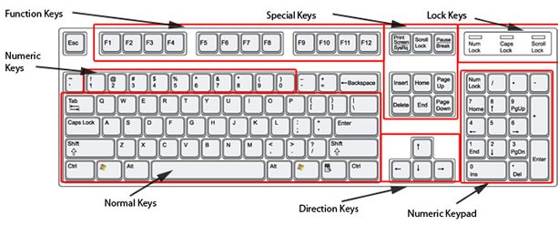
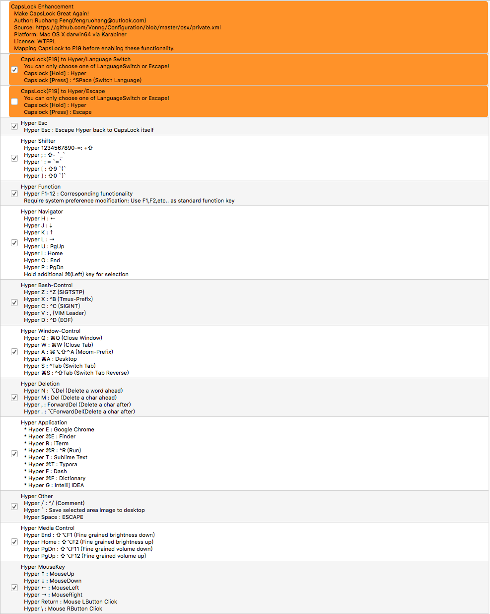

# Capslock

*Make CapsLock Great Again! —— Vonng*

将Capslock改造为强大的超级功能键

* 功能强大：CapsLock将与所有按键摩擦出火花。包括：Vim导航键、窗口控制、媒体控制、Bash控制、应用快捷方式、鼠标键、上档键、便捷括号、快捷删除等。
* 跨平台：基于[AutoHotKey](http://www.ahkscript.org/)（Win），[Karabiner](https://pqrs.org/osx/karabiner/)（OSX）
* 部署迁移方便：无论是放在U盘 还是Github上，仅需简单几步即可复刻环境。

## 前言

CapsLock，即所谓大写锁定键，起源可以追溯至打字机时代。不像今天的键盘，打字机是纯机械的设备，当按下Shift时，整套设备会与墨条纸袋发生位移，使原来的小写字母“上档”为大写字母。这样的操作对于小拇指来说是不小的负担，以至于接连输入两三个大写字母都显得比较困难。于是，在今天Capslock的位置上出现了其原型：Shiftlock功能键，可以在大小写状态之间切换与保持。这样的设计减轻了打字员的负担，同时也解决了一指禅选手的困境。

然而随着科技的进步，这样的问题已经不存在了。除了一指禅选手（也许再加上和大堆大堆宏定义的C，C++程序员），Shift已经能够完全满足人们的需求。然而这样一个'多余'的按键仍然顺着历史惯性保留了下来，占据了键盘的黄金位置。

历史上有很多人注意到了这一点，Capslock曾经在很多环境中被用作Ctrl，也在很多环境中用作语言切换的快捷键。某些方式还可以将两种模式集成：单按为语言切换/ESC，按住则表现为Ctrl。但是可以做的远远不止这些：不妨让CapsLock成为一个全新的、诸如`Ctrl`,` Alt`, `Shift`, `Win`, `Cmd`的新修饰键：**Hyper**。

## 说明

本着策略与机制相分离的原则，这里将`CapsLock`的功能设计规划与实现分成两部分。

首先来看一下标准的104键盘布局：

因为大多数笔记本和我用的87键盘没有数字键盘，所以这里数字键盘就不考虑了，Special Keys区大多数键笔记本键盘也没有，所以也不适合放什么重要的功能键。

设计如下：

1. `CapsLock`单独按下与长按的区分

   传统上扩展`Capslock`，要么是将其语言切换，要么是将其作为`Control`。但其实这两个功能并不矛盾，一个是单按触发，一个是按下时触发，所以完全可以合并在一起。

   单独按下Capslock时，会触发**语言切换**功能，按住不放时，则激活一个新的功能键`Hyper`，替代传统的`Ctrl`实现更多更丰富的定制功能。当然，另一种做法是将单独按下改造为`ESC`，这就要视需求选择了。

2. 导航键

   导航键包括：`↑`,`↓`，`←`，`→`,`Home`,`End`,`PgUp`,`PgDn`，提供了一套通用的光标移动操作。不过这些键都远离核心键区，导致移动光标需要把右手移开，这一点煞是恼人。最好是将这些导航键映射到右手的核心键区，通过按下`Capslock`键启用，同时需要在移动光标的同时，对文本选取的功能（`Shift`）提供良好支持。

   按下Capslock时，传统的VIM导航键`h,j,k,l`映射为方向键，而将这四个键上方的`u,i,o,p`分别映射为`PageUp`,`Home`, `End`,`PageDown `，提供全局的导航操作。另一方面，因为按下左手需要按下`Capslock`，右手需要控制导航键，都不适合按下两侧的`Shift`键进入文本选择模式，这时候比较好的选择是由左手大拇指同时按下⌘(Mac)或Alt(Win)，将组合键映射为导航键+`Shift`提供文本选取支持。

   这样，vim的导航不仅可以在vim的所有模式中使用，也可以在系统中全局使用了。

3. 删除键

   删除是极其频繁的功能，包括前删（BackSpace）与后删（Delete）。不过Mac和Windows的操作不太一致有些恼人，而且这两个键也都是远离核心键区操作不便。

   将`Capslock`+`nm,.`映射到不同的删除功能上，首先这四个键在`h`,`j`,`k`,`l`正下方，操作非常方便。`Hyper + m`映射为前删`Delete`(Mac)或退格`BackSpace`(Win)，`Hyper+ ,`设计为后删`ForwardDelete`(Mac)或`Delete`(Windows)。同时`n`和`.`则映射为相应的按下`Option`(Mac)或`Ctrl`(Win)的版本，即前删后删一个单词，类似vim的`dw`与`db`，提高长句删除效率。

   这样一来，Mac与Windows的删除行为终于保持一致了，而且删除功能由右手最为灵活的食指和中指负责操作，能大大提高编辑效率。

4. 上档键

   上档是CapsLock的传统功能。但通常Capslock对第二排数字键不起作用，这里不妨反其道行之，将Capslock+数字键映射为对应的上档符号，当然也可以考虑映射为其他的一些命令，例如IDE调试命令，配置切换命令等。同时，一些编程中的高频符号，比如括号，下划线，等于号，也可以从右上角拉下来，放到核心键区。

   比如`CapsLock+; : _` ，`Capslock + ' : =`，`Capslock + [ : (`，`Capslock + ] : )`。这样一来，高频符号下划线和等号就可以方便的录入了，而圆括号映射到方括号这里，让小中大括号一家终于团聚在一起，也减少了输入圆括号的手指位移。

5. 窗口控制

   除了切换应用程序窗口`⌘Tab`(Mac), `Alt+Tab`（Win）外，还有许多经常用到的窗口操作：譬如关闭窗口（关闭应用程序），关闭标签页，切换标签页等。

   CapsLock+Q是Quit，关闭窗口的意思，映射到`⌘Q`(Mac)或`Alt+F4`（Win）。

   CapsLock+W是关闭当前标签，映射到`⌘W`(Mac)或`Ctr+W`(Win)

   CapsLock+S是Switch的意思，切换当前标签页，映射到`^Tab`(Mac & Win)。

   CapsLock+A是两个挨着的键，一起按就是另一个窗口管理软件的Moom的meta-key。可以方便的缩放摆弄窗口，很好用。

   这几个快捷方式非常常用，在IDE或者浏览器里都很方便。

6. Bash控制

   在Bash中，我们习惯Capslock作为Ctrl使用。但是最常用的，必不可少的其实只有几个：

   CapsLock+Z映射到`^Z`，用于发送SIGTSTP挂起作业。

   CapsLock+X映射到`^B`，是终端复用软件Tmux的metakey。

   CapsLock+C映射到`^C`，用于发送SIGINT中断作业。

   CapsLock+V映射到`,`，是Vim的`<Leader> key`

   CapsLock+D映射到`^D`，用于发送`EOF`

   当然，在Windows下面，这些键可以作为传统的编辑键：撤销，剪切，拷贝，粘贴……

7. 媒体控制：

   在没有`Fn`的外接键盘上如何使用Mac的传统功能键？用`Hyper+FX`解忧愁。Capslock+F1就是调低亮度，依此类推。

8. 应用快捷键：

   应用快捷键应当可以用一只手就轻松按出，这也限制了应用快捷键所能使用的键区。基本上适合作为应用快捷键的按键就是左手食指覆盖的键区了。

   这里`ERTYFGB`作为应用快捷键，加上⌘总共可以设置14个高频应用程序的快捷方式。这里是我的设置：

   `Hyper-E： Google Chrome.app`，`Hyper-⌘E: Finder`，E取自Explore的涵义。

   `Hyper-R: iTerm`，`Hyper-⌘R: Ctrl+R (Run)`，R取自Run。

   `Hyper-T： Sublime Text.app`，`Hyper-⌘T: Typora`，T取自Text，放置了常用的文本编辑器。

   `Hyper-F： Dash.app`，`Dictionary`，F取自Find的涵义。最常用的查询软件。

   `Hyper-G： IntelliJ IDEA.app`，`Hyper-⌘G: Clion`，G就是`Great`的意思，所以放了IDE😂。

   `Hyper-B`可以放一些别的东西，目前当做了呼叫Emoji窗口的快捷键(`^⇧Space`)。