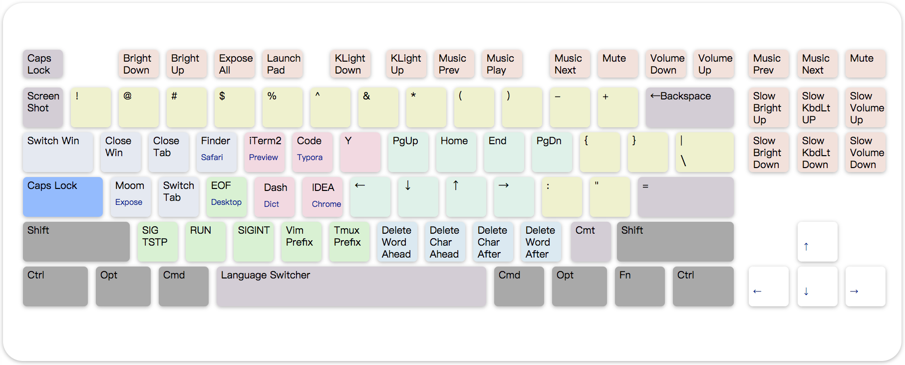

# Capslock

*Make CapsLock Great Again!*  


*Transform ⇪CapsLock into a powerful **modifier** **✱ Hyper** that miraculously increases your work productivity!*

[**中文文档 ZH** ](README_ZH.md)


## CapsLock ([v3](mac3/))

* **Powerful**: Transform Capslock into a great modifier: **Hyper(✱)**. (such as ⇧⌃⌥⌘)
* **Useful**: Navigation, mousekey, clipboard, window control, app shortcuts, term-signal, etc... **Redefine the keyboard!**
* **Speed-Up**: Optimized for developers, high-frequency move **stay in hot zone**.
* **Extensible**: Work with existing modifiers, which introduce **16 extra control planes**.
* **MouseKey**: Manipulate mouse cursor and wheels with keyboar
* **Cross-Platform**: MacOS and Windows. Lightwegith and portabl


## Install (MacOS)

Capslock serves via  [**Karabiner-Elements**](https://karabiner-elements.pqrs.org/)  on MacOS

### Version

* [Capslock V3](mac_v3) (2021-now)：Latest version
* [Capslock V2](mac/) (2018-2021)：MacOS 10.11 - 11
* [Capslock V1](mac_v1) (2015-2018)：MacOS Yosemite and below, no longer maintained.

### Procedure

1. Download and install [**Karabiner Elements**](https://karabiner-elements.pqrs.org/), following the wizard and grant required permissions.
2. Load the Capslock configuration file via links: [**Latest configuration file**](karabiner://karabiner/assets/complex_modifications/import?url=https://raw.githubusercontent.com /Vonng/Capslock/master/mac/capslock.json), [**Official Karabiner display configuration file**](karabiner://karabiner/assets/complex_modifications/import?url= https%3A%2F%2Fpqrs.org%2Fosx%2Fkarabiner%2Fcomplex_modifications%2Fjson%2Fcaps_lock_enhancement.json)

3. Launch Karabiner-Elements.  **Tab: ComplexModification** → **Button: Add Rules**, then enabled rulesets.


### Configuration

Karabiner's config can be loaded via URL. Click links below with Safari. It will launch karabiner and load config from URL.

* Lastest config in this repo: [https://raw.githubusercontent.com/Vonng/Capslock/master/mac/capslock.json](karabiner://karabiner/assets/complex_ modifications/import?url=https://raw.githubusercontent.com/Vonng/Capslock/master/mac/capslock.json)
* Karabiner Gallery: [https://pqrs.org/osx/karabiner/complex_modifications/json/caps_lock_enhancement.json](karabiner://karabiner/assets/complex_modifications/import?url=https%3A%2F%2Fpqrs.org%2Fosx%2Fkarabiner%2Fcomplex_modifications%2Fjson%2Fcaps_lock_enhancement.json)

```yaml
# Capslock Repo
karabiner://karabiner/assets/complex_modifications/import?url=https://raw.githubusercontent.com/Vonng/Capslock/master/mac/capslock.json

# Karabiner-Elements Offical Script Gallery
karabiner://karabiner/assets/complex_modifications/import?url=https://pqrs.org/osx/karabiner/complex_modifications/json/caps_lock_enhancement.json
```

If you can not access URL above. Download [**capslock.json**](mac/capslock.json) to：` ~/.config/karabiner/assets/complex_modifications/` and enabled it manually.

[**capslock.json**](mac/capslock.json) is the rule definition file. and [**capslock.yml**](mac/capslock.yml) is a more human readable version.  


### Compatibility

-  MacOS Big Sur (11.0 )
-  MacOS Catalina (10.15)
-  MacOS Mojave (10.14)
-  MacOS High Sierra (10.13)
-  MacOS Sierra (10.12)
-  MacOS EI Capitan (10.11)
-  MacOS Yosemite (10.10) or lower

> MacOS Yosemite (10.10) and lower version are not longer maintained. But you can find old XML configuration file in [mac-old](mac-old/)


## Install (Windows)

Capslock serves via   [**AutoHotKey**](https://www.autohotkey.com/) on Windows.

### Procedure

1. Download and install [**AutoHotKey**](https://www.autohotkey.com/).  Load [`capslock.ahk`](win/CapsLock.ahk) in AutoHotKey.
2. You can also use pre-compiled capslock ahk binary [CapsLock.exe](win/CapsLock.exe).

### Compatibility

* Windows 10
* Windows 8
* Windows 7
* Windows Vista
* Windows XP

> Capslock on Windows is **no longer maintained**. It may behave differently with mac version as time goes by. 


## Usage

Capslock works on **ANSI** keyboards and similar layouts. It literally remaps every keys on the keyboard. Including 10 categories.

|          Category           | Color  | Description                                                  |
| :-------------------------: | :----: | :----------------------------------------------------------- |
|       [Basic](#Basic)       |  Blue  | Press ⇪ Capslock  emit an  **⎋ Escape**. Hold it enabling the **✱ Hyper Modifier**. |
|  [Navigation](#Navigation)  |  Pink  | Vim style navigation. Cursor move, text selection, switch desktop/window/tab, mouse move/wheel,etc... |
|    [Deletion](#Deletion)    | Brown  | Maps `BNM,` to deletion operation to perform fast char/word/line deletion without hand move. |
|    [MouseKey](#MouseKey)    | Keypad | Maps keypad to fully functional mouse                        |
|      [Window](#Window)      | Azure  | Close app/win/tab, Switch app/win/tab/desktop, intergration with win-manager app such as Moom,Slate,Magnet |
| [Application](#Application) | Yellow | Shortcuts for launching or switching frequently used applications |
|    [Terminal](#Terminal)    | Green  | Sending high-freq signals (Ctrl-Z, Ctrl-D, Ctrl-C) and vim/tmux prefix meta key via  ✱ |
|   [Clipboard](#Clipboard)   | Purple | Turn numkeys into 10 different text clipboard. ✱⌘n copy and ✱n paste. |
|     [Shifter](#Shifter)     | Orange | Turn some keys into common code symbols.                     |
|  [Functional](#Functional)  |  Gray  | Screenshtots. Fine-grained light/volume control. Take function keys' function back! |



> **Control plane** is defined by combination of four extra left modifiers: ⌘⌥⌃⇧.This image is layout of plane 0.

| Plane | Modifiers | Plane | Modifiers | Plane | Modifiers |
| :---: | :-------: | :---: | :-------: | :---: | :-------: |
| **0** |     ✱     |   3   |    ✱⌘⌥    |   7   |   ✱⌘⌥⌃    |
|   1   |    ✱⌘     |   5   |    ✱⌘⌃    |  11   |   ✱⌘⌥⇧    |
|   2   |    ✱⌥     |   6   |    ✱⌥⌃    |  13   |   ✱⌘⌃⇧    |
|   4   |    ✱⌃     |   9   |    ✱⌘⇧    |  14   |   ✱⌥⌃⇧    |
|   8   |    ✱⇧     |  10   |    ✱⌥⇧    |  15   |   ✱⌘⌥⌃⇧   |
|       |           |  12   |    ✱⌃⇧    |       |           |

### Basic

|   Key   |   MapsTo   | Comment                                            |
| :-----: | :--------: | -------------------------------------------------- |
| ⇪ Press |  ⎋ Escape  | Click Capslock to emit Escape                      |
| ⇪ Hold  |  ✱  Hyper  | Hold Capslock to enable **Hyper** modifier.        |
|   ✱⎋    | ⇪ Capslock | Press to enable Capslock, Hold to disable Capslock |
|   ✱␣    |     ⌃␣     | Switch input source                                |

Note that ✱ is implemented as combinition of **ALL RIGHT MODIFIERS**:  ⌘⌥⌃⇧. Mainly for compatible & intergration reasons.

Hold  **✱ Hyper** to enable hyper functionalites. We will assume and omit that in subsequent document.

### Navigation

* `H`, `J`, `K`, `L`, `U`, `I`, `O`, `P` are used as **Navigators**. Maps to ←↓↑→⇞↖↘⇟ by default. (pink area). 
* 9 control planes has already been allocated for navigators.
* Hold additional ⌘ Command for **selection**.  (like holding ⇧shift in normal)
* Hold additional ⌥ Option for **jump move**.  (like holding ⌥ Option with arrows, move a word ahead/after, etc...) 
* Hold additional ⌘⌥ Option for **jump selection**. (such as select a word ahead/after)  
* Hold additional ⇧ Shift for **switching tab/app**. 
* Hold additional ⌃ Control for **desktop management** .
* Hold additional ⇧ Shift  with ⌘/⌥/⌃ turns to **mouse action**. ⌥ for cursor move, ⌃ for wheel move, ⌘ for reverse wheel move.

| Key\Mod |    ✱     |     ⌘      |     ⌥      |       ⌘⌥        |      ⌃      |     ⇧      |    ⇧⌃     |    ⇧⌥     |      ⇧⌘       |
| :-----: | :------: | :--------: | :--------: | :-------------: | :---------: | :--------: | :-------: | :-------: | :-----------: |
| Feature | **Move** | **Select** |  **Jump**  | **Go & Select** | **Desktop** | **Window** | **Wheel** | **Mouse** | **Rev Wheel** |
|    H    |    ←     | word left  | word left  |    word left    |  prev desk  |  prev tab  |     ←     |     ←     |       ←       |
|    J    |    ↓     | line down  |  para end  |    para head    |    Focus    |  next app  |     ↓     |     ↓     |       ↓       |
|    K    |    ↑     |  line up   | para head  |    para tail    |   Expose    |  prev app  |     ↑     |     ↑     |       ↑       |
|    L    |    →     | word right | word right |   word right    |  next desk  |  next tab  |     →     |     →     |       →       |
|    U    |  PageUp  | prev page  | mv line ↑  |    prev page    | fullscreen  |  zoom out  |     ←     |   Back    |       ←       |
|    I    |   Home   | line head  | line head  |    line head    |   Expose    |  prev win  |     ↓     |  LClick   |       ↓       |
|    O    |   End    |  line end  |  line end  |    line end     |  Hide All   |  next win  |     ↑     |  RClick   |       ↑       |
|    P    |  PageDn  | next page  | mv line ↓  |    next page    |  Launchpad  |  zoom in   |     →     |  Forward  |       →       |

#### Arrow Navigation

* Arrows ←↓↑→ to mouse actions too. Hold ⌥ Option to **slow down**, hold ⌘ Command  to **speed up**.

* Hold additional ⇧ Shift  turns to **wheel move**.  Extra ⌥ Option to **slow down**, and extra ⌘ Command  to **speed up**.
* ↩ Return maps to left **click**. With additional ⌘⌥⌃⇧ hold turns into right click, middle click, backward, forward.

| Key\Mod |      ✱       |      ⌥       |      ⌘      |     ⇧      |       ⇧⌥       |      ⇧⌘       |
| :-----: | :----------: | :----------: | :---------: | :--------: | :------------: | :-----------: |
| Feature |  Mouse Move  |  Slow move   |  Fast move  | Wheel Move |   Slow Wheel   |  Fast Wheel   |
|  ←↓↑→   | speed = 1600 |  speed / 2   |  speed * 2  | speed = 32 |   speed / 2    |   speed * 2   |
|    ↩    |  Left (MB1)  | Middle (MB3) | Right (MB2) | Left (MB1) | Backward (MB4) | Forward (MB5) |

### Deletion

 `N` `M` `,` `.`  are used as **Deletor keys**. Right below the navigators for fast access (brown area). 

| Key\Mod |        ✱         |         ⌘          |         ⌥          |
| :-----: | :--------------: | :----------------: | :----------------: |
|    N    | del a word ahead | del till line head | del the whole line |
|    M    | del a char ahead |  del a word ahead  | del the whole line |
|  Comma  | del a char after |  del a word after  | del the whole line |
| Period  | del a word after | del till line end  | del the whole line |
|    ⌫    |     del file     |     purge file     |                    |

### Mousekey

* Turn keypad into a mouse.  with 8 direction movement

* Numbers maps to 8 direction mouse move. Hold ⌥ Option to **slow down**, hold ⌘ Command  to **speed up**.

* Hold additional ⇧ Shift  turns to **wheel move**.  Extra ⌥ Option to **slow down**, and extra ⌘ Command  to **speed up**.

* First line maps to wheel move and `0`, `.`, `⌤`, `+`, `-` maps to five mouse buttons.

| `numlock`  wheel ⬅️ | `=` wheel ⬇️ | `/` wheel ⬆️ | `*` wheel ➡️ |
| :----------------: | :---------: | :---------: | :---------: |
|       `7` ↖️        |     8 ⬆️     |    `9` ↗️    |   `-` MB4   |
|       `4` ⬅️        |     `5`     |    `6` ➡️    |   `+` MB5   |
|        `1`↙️        |     2 ⬇️     |    `3` ↘️    |             |
|    **`0` ** MB1    |             |   `.` MB3   |   `⌤` MB2   |

### Window

* `Tab`, `Q`, `W`, `A`, `s` used as window control keys. Focuing on close/switch applications / windows / tabs / desktops.
* Windows management (resize, layout) leaves to external application such as [Moom](https://manytricks.com/moom/), [Magnet](https://apps.apple.com/us/app/magnet/id441258766), and [Slate](https://github.com/jigish/slate). Bind ⌃⌥⇧⌘A manually.


| 键\修饰 |      ✱      |       ⌘       |       ⌥        |       ⌃       |     ⇧      |
| :-----: | :---------: | :-----------: | :------------: | :-----------: | :--------: |
|   Tab   |  next app   |   prev app    | switch desktop |               | switch tab |
|    Q    |  close app  |   close app   |                |  Lock Screen  |   Logout   |
|    W    |  close tab  | close all win |                | Display Sleep |   Sleep    |
|    A    | **win app** |  expose all   |  show desktop  |   LaunchPad   |            |
|    S    |  next tab   |   prev tab    |    next win    |   prev win    |            |

### App Shortcuts

* `E` `R` `T` `Y` `F` `G` are used as application shortcuts. (yellow area)
* Popular apps and dev tools are registed to 3 default planes: ✱/⌘/⌥. 
* You can assign these shortcuts according to your own needs.

| Key\Mod |          ✱          |     ⌘     |      ⌥      |  ……  |
| :-----: | :-----------------: | :-------: | :---------: | :--: |
|    E    |       Safari        |  Finder   |    Mail     |      |
|    R    |       iTerm2        |  Preview  |  Terminal   |      |
|    T    | Visual Studio Code  |  Typora   |    Note     |      |
|    Y    |        Siri         | Karabiner | Amphetamine |      |
|    F    | Alfred (bind ⌃⌥⇧⌘F) |   Dash    | Dictionary  |      |
|    G    |    Intellij IDEA    |  Chrome   |  Calender   |      |

### Terminal Control

`D`, `Z`, `X`, `C`, `V`, `B` are used as terminal control keys. Sending singals and IDE commands. (green area)

| Key\Mod |                         ✱                          |          ⌘           |
| :-----: | :------------------------------------------------: | :------------------: |
|    D    |               `⌃D` Ctrl+D (Send EOF)               | Define (Force touch) |
|    Z    |               `⌃Z` Ctrl+Z  (SIGTSTP)               |  F5 (VS Code Debug)  |
|    X    |               `⌃R` Ctrl+R (IDE Run)                |  ⌃F5 (VS Code Run)   |
|    C    |                `⌃C`Ctrl+C (SIGINT)                 | ⇧F5（VS Code Stop）  |
|    V    |              `⌃V`Ctrl+V (Vim Prefix)               |                      |
|    B    | `⌃B`Ctrl+B ([Tmux](http://tmux.github.io)  Prefix) |                      |

### Clipboard

Number keys 1, 2, …, 9, 0 are used as **(text) clipboard**. Hold ⌘ to **copy**, and press to **paste**. (purple area)

| Key\Mod |         ✱         |        ⌘        |
| :-----: | :---------------: | :-------------: |
|    1    | Paste from clip 1 | Copy to clip 1  |
|    2    | Paste from clip 2 | Copy to clip 2  |
|   ……    |        ……         |       ……        |
|    0    | Paste from clip 0 | Copy to clip 10 |

### Shifter

* Trivial transformation for misc characters. (orange area)
* Some special tricks for developers. Such as `;'` maps to `:=` or `!=` (⌘)


|      Key\Mod       |        ✱        |    ⌘     |  ⌥   |
| :----------------: | :-------------: | :------: | :--: |
|     `-` Minus      |       `_`       | Zoom Out |      |
|     `=` Equal      |       `+`       | Zoom In  |      |
|  `[` Left Bracket  |       `(`       |   `{`    | `<`  |
| `]`  Right Bracket |       `)`       |   `}`    | `>`  |
|   `;` Semicolon    |       `!`       |   `:`    |      |
|  `'` Single Quote  |       `=`       |   `=`    |      |
|     `/` Slash      | `⌘/`  (Comment) |          |      |
|   `\` Backslash    | `⌘/`  (Comment) |          |      |

### Functional

- Use F1,…F12 as standard functional keys, while hold **✱ Hyper** to turn them back.

- ⌘Command  + F1 / F2 / F3 are used as desktop switcher. Enable shortcuts in system preference first:

  **Preference** → **Keyboard** → **Shortcuts** → **MissionControl** → Switch to Desktop 1/2/3

- If you are using RMBP with Bar, consider changing your bar back to function keys with:

  **Karabiner-Elements** → **Function Keys** → **Use all F1, F2, etc. keys as standard function keys** 

|      键\修饰      |           ✱           |  ⌘   | Comment                              |
| :---------------: | :-------------------: | :--: | ------------------------------------ |
|    `~` Accent     |         ⌃⇧⌘4          | ⇧⌘4  | Area selection screenshot(⌘ to file) |
|       `F1`        |   `BrightnessDown`    |  ⌃1  | Brightness Down / Desktop 1          |
|       `F2`        |    `BrightnessUp`     |  ⌃2  | Brightness Up / Desktop 2            |
|       `F3`        |      `ExposeAll`      |  ⌃3  | Expose All / Desktop 3               |
|       `F4`        |      `LaunchPad`      |      | Launchpad                            |
|       `F5`        |  `KeyboardLightDown`  |      | Keyboard Light Down                  |
|       `F6`        |   `KeyboardLightUp`   |      | Keyboard Light Up                    |
|       `F7`        |      `MusicPrev`      |      | Music Prev                           |
|       `F8`        |      `MusicPlay`      |      | Play / Pause                         |
|       `F9`        |      `MusicNext`      |      | Music Next                           |
|       `F10`       |        `Mute`         |      | Mute                                 |
|       `F11`       |     `VolumeDown`      |      | Volume Down                          |
|       `F12`       |      `VolumeUp`       |      | Volume Up                            |
| `F13` PrintScreen |         ⌃⇧⌘3          | ⇧⌘3  | Full Screentshot (⌘ to file)         |
| `F14` ScrollLock  |          ⇧⌘5          | ⇧⌘6  | Screenshot menu (⌘ touchbar snap)    |
|    `F15` Pause    |      `MusicPlay`      |      | Play / Pause                         |
|     `Insert`      |   ⇧⌥`BrightnessUp`    |      | Fine-Grained Brightness Down         |
|     `Delete`      |  ⇧⌥`BrightnessDown`   |      | Fine-Grained Brightness Up           |
|      `Home`       |  ⇧⌥`KeyboardLightUp`  |      | Fine-GrainedKeyboard Light Up        |
|       `End`       | ⇧⌥`KeyboardLightDown` |      | Fine-Grained Keyboard Light Down     |
|      `PgUp`       |     ⇧⌥`VolumeUp`      |      | Fine-Grained Volume Up               |
|      `PgDn`       |    ⇧⌥`VolumeDown`     |      | Fine-Grained Volume Down             |


## Symbol Reference

| Glyph |  Mac   | Glyph |  Win ⊞  |
| :---: | :-----: | :---: | :-----: |
|   ✱   |  Hyper  |   ✱   |  Hyper  |
|   ⌃   | Control |   ⌃   | Control |
|   ⌥   | Option  |   ⊞   | Windows |
|   ⇧   |  Shift  |   ⇧   |  Shift  |
|   ⌘   | Command |   ⎇   |  Alter  |

|  Glyph  |            Name            | Glyph |                                |
| :-----: | :------------------------: | :---: | :----------------------------: |
|    ⌘    |    Command, Cmd, Clover    |   ←   |           Left arrow           |
|    ⌃    |     Control, Ctl, Ctrl     |   ↓   |           Down arrow           |
|    ⌥    | Option, Opt, (Windows) Alt |   ↑   |            Up arrow            |
|    ⎇    |            Alt             |   →   |          Right arrow           |
|    ⇧    |           Shift            |   ⇞   |         Page Up, PgUp          |
|    ⇪    |          Capslock          |   ⇟   |        Page Down, PgDn         |
|    ⏏    |           Eject            |   ↖   |              Home              |
| ↩, ↵, ⏎ |  Return, Carriage Return   |   ↘   |              End               |
|    ⌤    |           Enter            |   ⇥   | Tab, Tab Right, Horizontal Tab |
|    ⌫    |     Delete, Backspace      |   ⇤   | Shift Tab, Tab Left, Back-tab  |
|    ⌦    |       Forward Delete       | ␣ / ␢ |          Space, Blank          |
|    ⎋    |        Escape, Esc         |   ❘⃝   |             Power              |
|    ⌧    |           Clear            |   ⇭   |            Num lock            |
|    ?⃝    |            Help            |      |          Context menu          |


## FAQ

**Q: Why using ✱ as the symbol for Hyper? **

**A**: Because the ASCII code for `*` is exactly 42, which is the ultimate answer to life, universe, and everything. ✱ (Heavy-Asterisk) is a pretty version of `*`.

**Q: Why is there no Linux OS support? **

**A**: I'm using Linux through MacOS terminal. It actually feels much better than raw Linux 😆.

**Q: Why windows version no longer maintained? **

**A**: I haven't used Windows for a long time except for gaming.

**Q: Why is there an older version in MacOS? **

**A**: There was an older version of Karabiner that used XML config.  Apple modified it's kernel architecture in MacOS Sierra (10.12) and many programs had to be overhauled. So then there was a new version of Karabiner, the Karabiner-Elements, which is still in use today.

**Q: How can I customize it to my needs? **.

**A**: Just change the configuration file.  Don't forget click the 'star' 🤩.

**Q: Is this original? **

**A**: I'm the first one to make a capslock overhaul schema as far as I know. The original win AHK version was wrote in 2013.  And the first mac version was wrote in 2015. It is the first capslock emulation schema in karabiner's [gallary](https://ke-complex-modifications.pqrs.org/#emulation-modes).

**Q: What's new in V3? **

**A**: The original v2 only use 1 ~ 3 control planes. While v3 uses up to 9 control planes. A large number of functions have been added to make the additional modifier ⌘⌥⌃⇧ functioning in a reasonable way.

**Q: Is there any incompatible changes in V3?**

**A**: ⌥+Navigator from mouse move to word jump; F13/F4 from music prev/next  to screenshot;  number keys from shifter to clipboard; and ⌘D from opening dictionary app to define.


## About

Author： [**Vonng**](https://vonng.com/en/) (rh@vonng.com)  (2013 - 2021)

License：Apache 2.0 License