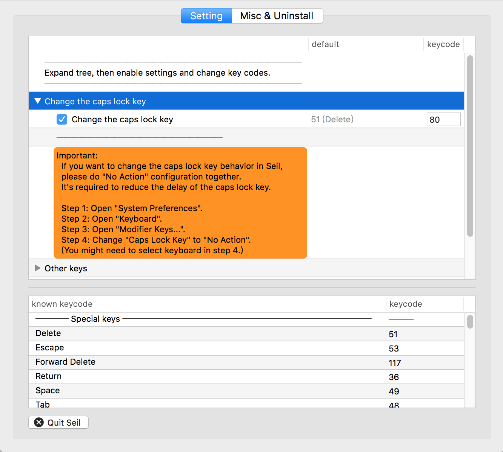

# Capslock (Mac OS X) 

## Notice

* Capslock for Mac is based on `karabiner` (and `seil`). But Karabiner **does not** work on **macOS Sierra(10.12)** at the moment. 

* It **works well** on EI Capitan(10.11) and Yosemite(10.10).

* no longer maintained. Check [CapsLock(mac-new)](../mac) for latest system support

  ​

## Install

* Step 1:   Download [`seil`](https://pqrs.org/osx/karabiner/seil.html.en) and install
* Step 2:   Download [`karabiner`](https://pqrs.org/osx/karabiner/) and install.
* Step 3:   Change capslock's keycode to 80 using `seil`
    
* Step 4:   `karabiner`
    * Switch to `Misc & Uninstall` panel.
    * Click `Open private.xml` button.
    * Copy and overwrite file: `private.xml`.
      
* Step 5:   
    * Switch back to `Change Key` panel
    * Click `Reload XML`
    * Enable functions you like :)
      

Enjoy~ 😁

## Usage

#### Basic 

* Hold  ⇪CapsLock，maps to ✱ Hyper
* Press ⇪CapsLock，maps to ⌃␣   (Switch input, **Conflict with ESC**)
* Press ⇪CapsLock，maps to ⎋  ESC （**Conflict with input switching**）

#### Navigators

* Hold (✱Hyper) to enable navigator，
* Hold additional ⌘ for selection. (just like holding shift simultaneously)
* `✱H ↦ ←` (vi style CursorLeft)
* `✱J ↦ ↓`  (vi style CursorDown)
* `✱K ↦ ↑`  (vi style CursorUp)
* `✱L ↦ →`  (vi style CursorRight)
* `✱U ↦ ⇞`  (PageUp)
* `✱I ↦ ↖` (Home)
* `✱O ↦ ↘` (End)
* `✱P ↦ ⇟`  (Pagedown)

#### Deletion

* `✱N ↦ ⌥⌫` (delete a word ahead)
* `✱M ↦ ⌫`    (delete a char ahead)
* `✱, ↦ ⌦`    (delete a char after)
* `✱. ↦ ⌥⌦`  (delete a word after)

#### Window Manipulation

* `✱A  ↦ ⌃⌥⇧⌘A` ([Moom](https://manytricks.com/moom/)-Meta，※a window resize app)
* `✱⌘A ↦ F11`         (Goto desktop)
* `✱Q  ↦ ⌘Q`            (Close window)
* `✱⇥  ↦ ⌃⇥`         ( Alter window )
* `✱⌘⇥ ↦ ⌃⇧⇥`      (Alter window reversely)
* `✱S  ↦ ⌃⇥`           (Alter tab)
* `✱⌘S ↦ ⌃⇧⇥`     (Alter tab reversely)
* `✱W  ↦ ⌘W`            (Close tab)

#### Bash Control

* `✱Z ↦ ⌃Z` (SIGTSTP))
* `✱X ↦ ⌃B` ([Tux](http://tmux.github.io)-Prefix)
* `✱C ↦ ⌃C` (SIGINT)
* `✱D ↦ ⌃D` (EOF)

#### Application shortcuts

Maybe you'd like overwrite these with your own favorite apps.

* `✱E  ↦ Google Chrome`
* `✱⌘E ↦ Finder`
* `✱R  ↦ iTerm`
* `✱⌘R ↦ ^R (IDE-Run)`
* `✱T  ↦ Typora`
* `✱⌘T ↦ MWeb`
* `✱F  ↦ Dash`
* `✱⌘F ↦ Dictionary`
* `✱G  ↦ IntelliJ IDEA`
* `✱V  ↦ Visual Studio Code`

  ​

#### Functional Keys

* `✱F1  ↦  BrightnessDown`
* `✱F2  ↦  BrightnessUp`
* `✱F3  ↦  ExposeAll`
* `✱F4  ↦  LaunchPad`
* `✱F5  ↦  KeyboardLightDown`
* `✱F6  ↦  KeyboardLightUp`
* `✱F7  ↦  MusicPrev`
* `✱F8  ↦  MusicPlay`
* `✱F9  ↦  MusicNext`
* `✱F10 ↦  Mute`
* `✱F11 ↦  VolumeDown`
* `✱F12 ↦  VolumeUp`

#### Shifter

* `✱[12...-=] ↦ ⇧[12...-=]` (0-9,-,=, goes to corresponding shifter)
* `✱[] ↦ ⇧90 '()'`  (square bracket to parenthese)

#### Special

* `✱Ins ↦ ⇧⌥F1`  (Insert: Fine grained brightness up)
* `✱Del ↦ ⇧⌥F2`  (Delete: Fine grained brightness down)
* `✱↘   ↦ ⇧⌥F5` (Home: Fine grained keyboard light up)
* `✱↖   ↦ ⇧⌥F6` (End: Fine grained keyboard light down)
* `✱⇟   ↦ ⇧⌥F11` (PgUp: Fine grained volume up)
* `✱⇞   ↦ ⇧⌥F12` (PgDn: Fine grained volume down)
* `✱ScrollLock  ↦ VolumeMute` (Mute)
* `✱Pause       ↦ MusicPlay` (Music play)

#### Cursors

* `✱↑ ↦ MouseUp`

* `✱↓ ↦ MouseDown`
* `✱← ↦ MouseLeft`
* `✱→ ↦ MouseRight`
* `✱↩ ↦ MouseLButton`
* `✱\ ↦ MouseRButton`

#### Other

- `✱⎋  ↦ ⇪`       (Escape turn ✱Hyper backs to ⇪CapsLock)
- `✱␢   ↦ ⎋`      (Space maps to ⎋ESC)
- `✱\  ↦ ⌃/`       (Back slash maps to comment [IDE shortcut])
- `✱;  ↦ ⇧-  '_' `  (Semicolon to lodash)
- `✱'  ↦ =`           (Single quote to equal)
- `✱~    ↦ ⌃⇧⌘4`(tilde to area screenhot)
- `✱⌘~ ↦ ⌃⇧4`  (⌘tilde to area screenhost to clipboard)