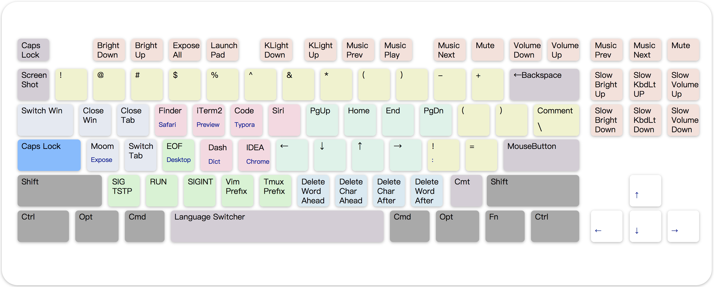

# Capslock补完计划 (mac v3)


### MacOS安装

在MacOS上，Capslock通过 [**Karabiner-Elements** 提供服务](https://karabiner-elements.pqrs.org/)

1. 下载并安装 [**Karabiner Elements**](https://karabiner-elements.pqrs.org/)，按照安装向导提示完成安装并赋予所需权限。


2. 将 [**capslock.json**](mac_v3/capslock.json) 下载至` ~/.config/karabiner/assets/complex_modifications/` 目录。

   或使用Safari打开下面的链接，将自动启动Karabiner并加载Capslock配置文件。

   ```yaml
   # Capslock 官方网站 (v3)
   karabiner://karabiner/assets/complex_modifications/import?url=https://vonng.com/capslock.json
   
   # Capslock Mac V3 (当前Repo)
   karabiner://karabiner/assets/complex_modifications/import?url=https://raw.githubusercontent.com/Vonng/Capslock/master/mac_v3/capslock.json
   
   # Karabiner-Elements 官方陈列馆（Emulation Mode第一个）
   karabiner://karabiner/assets/complex_modifications/import?url=https://pqrs.org/osx/karabiner/complex_modifications/json/caps_lock_enhancement.json
   ```


3. 打开Karabiner-Elements，切至第三标签页`ComplexModification`，点击左下方按钮 `Add Rules`按需启用Capslock预置规则即可。

   


## 功能

Capslock以**ANSI**布局键盘为蓝本，对Capslock之外的 [**所有按键**](#符号) 进行了功能定制与修饰，主要分为10大类功能。



> [**控制平面**](控制平面) 由左侧修饰键的排列组合所定义：根据 ⌘⌥⌃⇧的状态，最多有16个额外的控制平面。上图为0号控制平面布局。

|         类目          |  颜色  | 说明                                                         |
| :-------------------: | :----: | :----------------------------------------------------------- |
| [基础功能](#基础功能) |   蓝   | 单击Capslock发送**Esc**，按住Capslock启用✱功能。✱Esc切换大小写锁，✱空格切换输入法。 |
| [导航功能](#导航功能) |   粉   | VI式导航，结合⌃⌥⌘⇧启用多种功能：光标移动，词句选择，窗口管理，鼠标移动等等… |
| [删除功能](#删除功能) |   棕   | 快速执行字/词/句/行/页的删除操作，手无需离开核心区。         |
|   [鼠标键](#鼠标键)   | 小键盘 | 将小键盘映射为一个功能完整的鼠标。                           |
| [窗口管理](#窗口管理) |  淡蓝  | 切换或关闭桌面/应用/窗口/选项卡，睡眠/锁屏/熄屏/登出。集成外部窗口管理应用。 |
| [应用捷径](#应用捷径) |   黄   | 启动或切换至常用应用，预置MacOS高频应用与流行的开发者工具。  |
| [终端控制](#终端控制) |   绿   | 发送常用终端控制信号，IDE运行命令，Vim/Tmux的元按键。        |
| [文本剪贴](#文本剪贴) |   紫   | 将数字键用做10个额外的文本剪贴板：⌘n复制，n粘贴。            |
| [上档变换](#上档变换) |   橙   | 将一些键映射至常用高频字符。                                 |
| [功能控制](#功能控制) |   青   | 将F1-F2转义回原本的功能，截屏录屏，音量灯光的精密控制。      |

### 基础功能

|  按键  |   映射为   | 说明                                       |
| :----: | :--------: | ------------------------------------------ |
| ⇪ 点击 |  ⎋ Escape  | 单击Capslock发送ESC                        |
| ⇪ 按住 |  ✱  Hyper  | 按住Capslock启用Hyper                      |
|   ✱⎋   | ⇪ Capslock | **单击**ESC切换大写锁定                    |
|   ✱␣   |     ⌃␣     | **单击**空格切换输入法，+⌘时打开表情符号页 |

注意，✱ 在实现上被定义为同时按下所有的右侧⌘⌥⌃⇧修饰符，这样设计的主要原因是将快捷键透传到外部应用。（如Alfred，Moom等）

后续介绍如果没有特殊说明，均假定 ✱  Hyper 处于按下状态。

### 导航功能

* `H`, `J`, `K`, `L`, `U`, `I`, `O`, `P`  被用作**基本导航键**，分别映射为←↓↑→⇞↖↘⇟（左下上右/PgUp/Home/End/PgDn），位于图中粉色区域。
* 基本导航键配合**左侧修饰键**可启用多种导航功能，默认配置了9个**控制平面**。
* 按住 ⌘ Command，效果为**文本选择**，额外按住⌥ Option 时，选择单位会变为**前后词语**与**上下3行**。
* 按住⇧ Shift 的效果为**应用/窗口/标签切换**，按住⌃ Control 的效果为**桌面管理**。
* 按住 ⌥ Option 效果为🖱️**鼠标移动**， 额外按下⇧Shift将**移速翻倍** ⏫。  (`U`, `I`, `O`, `P` 映射为鼠标左击，右击，后退，前进)。
* 按住⇧⌥将导航键变为 🖲️ **鼠标滚轮**，⇧⌘**移速翻倍** 。其中HJKL为正常滚动，UIOP自然滚动（反向）。

| **功能** | **移动** | **选择** | **快速选择** | **窗口管理** | **桌面管理** |  🖱️   | **🖱️⏫** |  🖲️   |  🖲️⏫  |
| :------: | :------: | :------: | :----------: | :----------: | :----------: | :--: | :----: | :--: | :--: |
| 键\修饰  |    ✱     |    ⌘     |      ⌘⌥      |      ⇧       |      ⌃       |  ⌥   |   ⇧⌃   |  ⇧⌥  |  ⇧⌘  |
|    H     |    ⬅️     | 左选一字 |   左选一词   |   先前Tab    |   上个桌面   |  ⬅️   |   ⬅️⏫   |  ⬅️   |  ⬅️⏫  |
|    J     |    ⬇️     | 下选一行 |   下选三行   |   切换应用   |   聚焦窗口   |  ⬇️   |   ⬇️⏫   |  ⬇️   |  ⬇️⏫  |
|    K     |    ⬆️     | 上选一行 |   上选三行   |   先前应用   |   暴露所有   |  ⬆️   |   ⬆️⏫   |  ⬆️   |  ⬆️⏫  |
|    L     |    ➡️     | 右选一字 |   右选一词   |   切换Tab    |   下个桌面   |  ➡️   |   ➡️⏫   |  ➡️   |  ➡️⏫  |
|    U     |   PgUp   | 选至上页 |   选至上页   |     缩小     |     全屏     |  🖱️L  |   🖱️L   |  ➡️   |  ➡️   |
|    I     |   Home   | 选至行首 |   尾至行首   |   上个窗口   |   隐藏窗口   |  🖱️R  |   🖱️R   |  ⬆️   |  ⬆️⏫  |
|    O     |   End    | 选至行尾 |   首至行尾   |   切换窗口   |   隐藏所有   |  🖱️B  |   🖱️B   |  ⬇️   |  ⬇️⏫  |
|    P     |   PgDn   | 选至下页 |   选至下页   |     放大     |   启动菜单   |  🖱️F  |   🖱️F   |  ⬅️   |  ⬅️⏫  |

#### 方向键导航

* 方向键 ←↓↑→ 用于模拟 🖱️**鼠标移动**。额外按住 ⌥ Option ⏬ **减速**，额外按住 ⌘ Command ⏫ **加速**。
* 按住 ⇧Shift 切换至 🖲️**滚轮移动**。额外按住 ⌥ Option ⏬ **减速**，额外按住⌘ Command ⏫ **加速**。
* 按下↩回车键为鼠标左键单击，配合⌘⌥⌃⇧使用时会相应转化为鼠标的右键，中键，后退键，前进键。

| **功能** |     🖱️     |   🖱️⏬   |   🖱️⏫   |    🖲️    |   🖲️⏬   |   🖲️⏫   |
| :------: | :-------: | :----: | :----: | :-----: | :----: | :----: |
| 键\修饰  |     ✱     |   ⌥    |   ⌘    |    ⇧    |   ⇧⌥   |   ⇧⌘   |
|   ←↓↑→   | 移速=1600 | 移速÷2 | 移速×2 | 滚速=32 | 滚速÷2 | 滚速×2 |
|    ↩     |    🖱️L     |   🖱️M   |   🖱️R   |   🖱️L    |   🖱️B   |   🖱️F   |

### 删除功能

 `N` `M` `,` `.`  用做删除键。删除操作位于导航键`HJKL`下方，用于快速执行文本删除。

| 键\修饰 |    ✱     |      ⌘       |    ⌥     |
| :-----: | :------: | :----------: | :------: |
|    N    | 前删一词 |   删至行首   | 整行删除 |
|    M    | 前删一字 |   前删一词   | 将行下移 |
|    ,    | 后删一字 |   后删一词   | 将行上移 |
|    .    | 后删一词 |   删至行尾   | 整行删除 |
|    ⌫    | 删除文件 | 永久删除文件 |          |

### 鼠标键

* 1-9号数字控制🖱️ **鼠标移动**方向，额外按住 ⌥ Option 时 ⏬**减速**，按住⌘ Command 时 ⏫**加速**。
* 按住⇧ Shift 切换为🖲️ **滚轮滚轮**，在此模式下，额外按住 ⌥ Option 时 ⏬ **减速**，额外按住⌘ Command ⏫ **加速**。
* 第一行（`numlock`, `=`, `/`, `*`）转换为鼠标滚动操作，右下侧其余按键（`0`, `.`, `⌤`, `+`, `-`）转换为鼠标的5个按键.

| <kbd>⇭</kbd>  🖲️⬅️ | <kbd>=</kbd> 🖲️⬇️ | <kbd>/</kbd>  🖲️⬆️ | <kbd>*</kbd>  🖲️➡️ |
| :--------------: | :-------------: | :--------------: | :--------------: |
| <kbd>7</kbd>🖱️ ↖️  | <kbd>8</kbd> 🖱️⬆️ | <kbd>9</kbd> 🖱️↗️  | <kbd>-</kbd> 🖱️B  |
| <kbd>4</kbd>🖱️ ⬅️  |  <kbd>5</kbd>🖱️  | <kbd>6</kbd> 🖱️➡️  | <kbd>+</kbd> 🖱️F  |
|  <kbd>1</kbd>🖱️↙️  | <kbd>2</kbd> 🖱️⬇️ | <kbd>3</kbd> 🖱️↘️  |                  |
| <kbd>0</kbd> 🖱️L  |                 | <kbd>.</kbd> 🖱️M  | <kbd>⌤</kbd> 🖱️R  |

### 窗口管理

* `Tab`, `Q`, `W`, `A`, `s`用于窗口管理，关注应用/窗口/标签页/桌面的切换，关闭等功能。位于图中天蓝色区域。

* 窗口管理功能（调整大小布局）是通过外部应用完成的，例如[Moom](https://manytricks.com/moom/)，[Magnet](https://apps.apple.com/us/app/magnet/id441258766)，[Slate](https://github.com/jigish/slate)等，您需要为其绑定⌃⌥⇧⌘A作为触发快捷键。

| 键\修饰 |      ✱       |     ⌘      |       ⌥        |       ⌃        |    ⇧    |
| :-----: | :----------: | :--------: | :------------: | :------------: | :-----: |
| `⇥` Tab |   上个应用   |  下个应用  |    下个桌面    |                | 切换Tab |
|   `Q`   |   关闭应用   |  关闭应用  |                |      锁屏      |  注销   |
|   `W`   |   关闭窗口   |  关闭窗口  |                |      熄屏      |  睡眠   |
|   `A`   | **窗口管理** |  暴露窗口  |    显示桌面    |   LaunchPad    |         |
|   `S`   |  下个标签页  | 上个标签页 | 上个同应用窗口 | 下个同应用窗口 |         |

### 应用捷径

* `E` `R` `T` `Y` `F` `G`  被用作默认的应用捷径热键，位于图中黄色区域。
* 高频系统应用与流行的开发者工具已经被默认分配至3个控制平面中 ✱/⌘/⌥。
* 您可以通过修改配置文件自行定制喜欢的应用。

| 键\修饰 |          ✱          |     ⌘     |      ⌥      |  ……  |
| :-----: | :-----------------: | :-------: | :---------: | :--: |
|    E    |       Safari        |  Finder   |    Mail     |      |
|    R    |       iTerm2        |  Preview  |  Terminal   |      |
|    T    | Visual Studio Code  |  Typora   |    Note     |      |
|    Y    |        Siri         | Karabiner | Amphetamine |      |
|    F    | Alfred (bind ⌃⌥⇧⌘F) |   Dash    | Dictionary  |      |
|    G    |    Intellij IDEA    |  Chrome   |  Calender   |      |

### 终端控制

`D`, `Z`, `X`, `C`, `V`, `B` 用于终端控制，发送信号与IDE命令，位于图中绿色区域。

| 键\修饰 |                     ✱                      |          ⌘          |
| :-----: | :----------------------------------------: | :-----------------: |
|    D    |                 ⌃D  (EOF)                  |   定义 (压感点击)   |
|    Z    |               ⌃Z   (SIGTSTP)               | F5 (VS Code Debug)  |
|    X    |               ⌃R  (IDE Run)                |  ⌃F5 (VS Code Run)  |
|    C    |                ⌃C (SIGINT)                 | ⇧F5（VS Code Stop） |
|    V    |              ⌃V (Vim Prefix)               |                     |
|    B    | ⌃B ([Tmux](http://tmux.github.io)  Prefix) |                     |

### 文本剪贴

* 数字键 1, 2, …, 9, 0 用作剪贴板，按下 ⌘ Command +数字键**拷贝**，按下数字键粘贴。位于图中紫色区域。

| 键\修饰 |       ✱       |       ⌘       |
| :-----: | :-----------: | :-----------: |
|    1    | 从剪贴板1粘贴 | 拷贝至剪贴板1 |
|    2    | 从剪贴板2粘贴 | 拷贝至剪贴板2 |
|   ……    |      ……       |      ……       |
|    0    | 从剪贴板0粘贴 | 拷贝至剪贴板0 |

### 上档变换


- 朴素的字符映射，将一些字符转换为另一些常用字符，便于输入，位于图中橙色区域。
- 部分字符会针对开发者有特殊优化映射，例如`;'`会被映射为`:=`，或`!=`（⌘），便于输入比较与赋值表达式。


| 键\修饰 |  ✱   |    ⌘     |  ⌥   |
| :-----: | :--: | :------: | :--: |
|   `-`   | `_`  | 页面缩小 |      |
|   `=`   | `+`  | 页面放大 |      |
|   `[`   | `(`  |   `{`    | `<`  |
|   `]`   | `)`  |   `}`    | `>`  |
|   `;`   | `!`  |   `:`    |      |
|   `'`   | `=`  |   `=`    |      |
|   `/`   |  ⌘/  |          |      |
|   `\`   |  ⌘/  |          |      |

### 功能控制

- 将 F1,F2,..., F12等用作标准功能键，按下✱将其转义回原来的功能，位于图中青色区域。

- ⌘Command + F1/F2/F3 为切换桌面快捷键，但您必须先在启用系统相关快捷键：

  **系统设置** → **键盘** → **快捷键** → **调度中心** → 启用桌面切换快捷键。

- 如果您使用带TouchBar的Macbook键盘，可以将TouchBar修改回标准功能键组。

  **Karabiner-Elements** → **Function Keys** → **Use all F1, F2, etc. keys as standard function keys** 

| 键\修饰  |                  ✱                   |  ⌘   | 说明                         |
| :------: | :----------------------------------: | :--: | ---------------------------- |
|    `     |                 ⌃⇧⌘4                 | ⇧⌘4  | 区域选择截图（+⌘保存至桌面） |
|    F1    | display_brightness_decrement  \|  ⌃1 |  ⌃1  | 调低屏幕亮度/桌面1           |
|    F2    |  display_brightness_increment \| ⌃2  |  ⌃2  | 调高屏幕亮度/桌面2           |
|    F3    |              ⌃↑  \|  ⌃3              |  ⌃3  | 暴露窗口/桌面3               |
|    F4    |              Launchpad               |      | 启动面板                     |
|    F5    |        illumination_decrement        |      | 调暗键盘灯                   |
|    F6    |        illumination_increment        |      | 调亮键盘灯                   |
|    F7    |                rewind                |      | 上一首音乐                   |
|    F8    |            play_or_pause             |      | 播放 / 暂停                  |
|    F9    |             fastforward              |      | 下一首音乐                   |
|   F10    |                 mute                 |      | 静音                         |
|   F11    |           volume_decrement           |      | 调低音量                     |
|   F12    |           volume_increment           |      | 调高音量                     |
|   F13    |                 ⌃⇧⌘3                 | ⇧⌘3  | 全屏截图｜（+⌘保存至桌面）   |
|   F14    |                 ⇧⌘5                  | ⇧⌘6  | 截图菜单｜（+⌘触控栏截图）   |
|   F15    |            play_or_pause             |      | 播放 / 暂停                  |
|  Insert  |   ⇧⌥ display_brightness_increment    |      | 平滑调高亮度                 |
| Delete ⌦ |   ⇧⌥ display_brightness_decrement    |      | 平滑调低亮度                 |
|  Home ↖  |      ⇧⌥ illumination_increment       |      | 平滑调亮键盘灯               |
|  End ↘   |      ⇧⌥ illumination_decrement       |      | 平滑调暗键盘灯               |
|  PgUp ⇞  |         ⇧⌥ volume_increment          |      | 平滑调高音量                 |
|  PgDn ⇟  |         ⇧⌥ volume_decrement          |      | 平滑调低音量                 |


## 参考

### 符号释义


|                      Glyph                       |     Name      |          Glyph           |          Name          |
| :----------------------------------------------: | :-----------: | :----------------------: | :--------------------: |
|                   <kbd>⇪</kbd>                   |   Capslock    |       <kbd>✱</kbd>       |         Hyper          |
|                   <kbd>⎋</kbd>                   |    Escape     |       <kbd>␣</kbd>       |         Space          |
|                   <kbd>⌘</kbd>                   | Command (Mac) |       <kbd>⎇</kbd>       |      Alter (Win)       |
|                   <kbd>⌥</kbd>                   | Option (Mac)  |       <kbd>⊞</kbd>       |       Win (Win)        |
|                   <kbd>⌃</kbd>                   |    Control    |       <kbd>⇧</kbd>       |         Shift          |
|                   <kbd>↩</kbd>                   |    Return     |       <kbd>⌤</kbd>       |         Enter          |
| <kbd>←</kbd><kbd>↓</kbd><kbd>↑</kbd><kbd>→</kbd> | Arrow Cursor  | <kbd>↖</kbd><kbd>↘</kbd> |        Home/End        |
|             <kbd>⇥</kbd><kbd>⇤</kbd>             |      Tab      | <kbd>⌫</kbd><kbd>⌦</kbd> | Delete / ForwardDelete |
|                   <kbd>⇭</kbd>                   |    Numlock    |            ⏫⏬            |      Fast / Slow       |
|                        🖱️L                        |   左键单击    |            🖱️B            |        鼠标后退        |
|                        🖱️R                        |   右键单击    |            🖱️F            |        鼠标前进        |
|                        🖱️M                        |   中键单击    |            🖲️             |        鼠标滚轮        |

