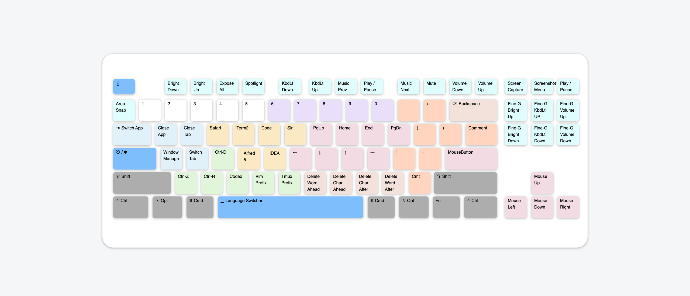

# Capslock Enhancement (mac v3) 


### macOS Installation

This guide was verified with Karabiner-Elements 16.1.0 in August 2026. The current release supports macOS 13–27 on Intel and Apple silicon.

1. Download [Karabiner-Elements](https://karabiner-elements.pqrs.org/), open the DMG, and run `Karabiner-Elements.pkg`.

2. Open Karabiner-Elements Settings and follow its System Settings prompts. Allow both background services, Accessibility, Input Monitoring, and the Driver Extension. In **Virtual Keyboard**, select the layout matching your physical keyboard. See the [official installation guide](https://karabiner-elements.pqrs.org/docs/getting-started/installation/).

3. Open this browser link to import the current V3 configuration:

   ```text
   karabiner://karabiner/assets/complex_modifications/import?url=https://raw.githubusercontent.com/Vonng/Capslock/main/mac_v3/capslock.json
   ```

   In Karabiner-Elements Settings, use **Complex Modifications → Add predefined rule → Import more rules from the internet**, complete **Import/Allow**, and enable the rules you need. Confirm the result with Karabiner-EventViewer. See the [official complex-modifications guide](https://karabiner-elements.pqrs.org/docs/manual/configuration/configure-complex-modifications/).

   For manual installation, download [**capslock.json**](capslock.json) into `~/.config/karabiner/assets/complex_modifications/` and then choose **Add predefined rule**.


## Usage

Capslock works on **ANSI** keyboards and similar layouts. It literally remaps every [**keys**](#Symbols) on the keyboard. Including 10 categories.



> **[Control Planes](#Control-Planes)** are defined by combination of four extra left modifiers: <kbd>⌘</kbd><kbd>⌥</kbd><kbd>⌃</kbd><kbd>⇧</kbd>.This image shows the layout of control plane 0.

|           Category            | Color  | Description                                                  |
| :---------------------------: | :----: | :----------------------------------------------------------- |
|        [Basic](#Basic)        |  Blue  | Press <kbd>⇪</kbd> Capslock  emit an  **<kbd>⎋</kbd> Escape**. Hold it enabling the **<kbd>✱</kbd> Hyper Modifier**. |
|   [Navigation](#Navigation)   |  Pink  | Vim style navigation. Cursor move, text selection, switch desktop/window/tab, mouse move/wheel,etc... |
|     [Deletion](#Deletion)     | Brown  | Maps `BNM,` to deletion operation to perform fast char/word/line deletion without hand move. |
|     [MouseKey](#MouseKey)     | Keypad | Maps keypad to fully functional mouse                        |
|   [Window](#window-control)   | Azure  | Close or switch apps, windows, tabs, and desktops; integrate with an external window manager. |
| [Application](#app-shortcuts) | Yellow | Shortcuts for launching or switching frequently used applications |
| [Terminal](#terminal-control) | Green  | Send high-frequency signals and IDE commands, launch Codex/Claude, and use Vim/Tmux prefix keys via <kbd>✱</kbd>. |
|    [Clipboard](#Clipboard)    | Purple | Turn number keys 6–0 into five text clipboards. <kbd>✱</kbd><kbd>⌘</kbd>n copies and <kbd>✱</kbd>n pastes. |
|      [Shifter](#Shifter)      | Orange | Turn some keys into common code symbols.                     |
|   [Functional](#Functional)   |  Cyan  | Screenshots, standard function keys, and fine-grained light/volume control. |

### Basic

|   Key   |   MapsTo   | Comment                                            |
| :-----: | :--------: | -------------------------------------------------- |
| <kbd>⇪</kbd> Press |  <kbd>⎋</kbd> Escape  | Click Capslock to emit Escape                      |
| <kbd>⇪</kbd> Hold  |  <kbd>✱</kbd>  Hyper  | Hold Capslock to enable **Hyper** modifier.        |
|   <kbd>✱</kbd><kbd>⎋</kbd>    | <kbd>⇪</kbd> Capslock | Press to switch Capslock status |
|   <kbd>✱</kbd><kbd>␣</kbd>    |     <kbd>⌃</kbd><kbd>␣</kbd>     | Switch input source, +<kbd>⌘</kbd> to emoji                   |

Note that <kbd>✱</kbd> is implemented as combination of **ALL RIGHT MODIFIERS**:  <kbd>⌘</kbd><kbd>⌥</kbd><kbd>⌃</kbd><kbd>⇧</kbd>. 

Hold  **<kbd>✱</kbd> Hyper** to enable hyper functionalities. We will assume and omit that in subsequent document.

### Navigation

* <kbd>H</kbd>, <kbd>J</kbd>, <kbd>K</kbd>, <kbd>L</kbd>, <kbd>U</kbd>, <kbd>I</kbd>, <kbd>O</kbd>, <kbd>P</kbd> are used as **Navigators**. Maps to <kbd>←</kbd><kbd>↓</kbd><kbd>↑</kbd><kbd>→</kbd><kbd>⇞</kbd><kbd>↖</kbd><kbd>↘</kbd><kbd>⇟</kbd> by default. (pink area). 
* 9 control planes has already been allocated for navigators.
* Hold additional <kbd>⌘</kbd> Command for **selection**.  (like holding <kbd>⇧</kbd>shift in normal), additional <kbd>⌥</kbd> Option for **word/para selection**.
* Hold additional <kbd>⇧</kbd> Shift for **app/win/tab switching**.  Hold additional <kbd>⌃</kbd> Control for **desktop management** .
* Hold additional <kbd>⌥</kbd> Option for 🖱️ **mouse move**.  Add <kbd>⇧</kbd>shift to **⏫ accelerate**.  (<kbd>U</kbd>, <kbd>I</kbd>, <kbd>O</kbd>, <kbd>P</kbd> maps to mouse buttons) .
* <kbd>⇧</kbd><kbd>⌥</kbd> turns navigator to **🖲️ mouse wheel**, and <kbd>⇧</kbd><kbd>⌘</kbd> is the ⏫ **accelerated** version .  `HJKL` for wheel, wihle `UIOP` for reversed wheel move.

| Feature | **Move** | **Select** | **WordSel** | **Window** | **Desktop** |  🖱️   | **🖱️⏫** |  🖲️   |  🖲️⏫  |
| :-----: | :------: | :--------: | :---------: | :--------: | :---------: | :--: | :----: | :--: | :--: |
| Key\Mod |    <kbd>✱</kbd>     |     <kbd>⌘</kbd>      |     <kbd>⌘</kbd><kbd>⌥</kbd>      |     <kbd>⇧</kbd>      |      <kbd>⌃</kbd>      |  <kbd>⌥</kbd>   |   <kbd>⇧</kbd><kbd>⌥</kbd>   |  <kbd>⇧</kbd><kbd>⌃</kbd>  |  <kbd>⇧</kbd><kbd>⌘</kbd>  |
|    <kbd>H</kbd>    |   Left   | word left  |  word left  |  prev tab  |  prev desk  |  ⬅️   |   ⬅️⏫   |  ⬅️   |  ⬅️⏫  |
|    <kbd>J</kbd>    |   Down   | line down  | 3 line down |  next app  |    focus    |  ⬇️   |   ⬇️⏫   |  ⬇️   |  ⬇️⏫  |
|    <kbd>K</kbd>    |    Up    |  line up   |  3 line up  |  prev app  | expose all  |  ⬆️   |   ⬆️⏫   |  ⬆️   |  ⬆️⏫  |
|    <kbd>L</kbd>    |  Right   | word right | word right  |  next tab  |  next desk  |  ➡️   |   ➡️⏫   |  ➡️   |  ➡️⏫  |
|    <kbd>U</kbd>    |   PgUp   | prev page  |  prev page  |   zoom-    | fullscreen  |  🖱️L  |   🖱️L   |  ➡️   |  ➡️⏫  |
|    <kbd>I</kbd>    |   Home   | line head  |  end2head   |  prev win  |    hide     |  🖱️R  |   🖱️R   |  ⬆️   |  ⬆️⏫  |
|    <kbd>O</kbd>    |   End    |  line end  |  head2end   |  next win  |  hide all   |  🖱️B  |   🖱️B   |  ⬇️   |  ⬇️⏫  |
|    <kbd>P</kbd>    |   PgDn   | next page  |  next page  |   zoom+    |  Spotlight  |  🖱️F  |   🖱️F   |  ⬅️   |  ⬅️⏫  |


#### Arrow Navigation


* Arrows <kbd>←</kbd>↓<kbd>↑</kbd>→ to 🖱️ **mouse**  actions too. Hold <kbd>⌥</kbd> Option to ⏬ **slow down**, hold <kbd>⌘</kbd> Command  to ⏫ **speed up**.
* Hold  <kbd>⇧</kbd> Shift  turns to 🖲️ **wheel move**.  Extra <kbd>⌥</kbd> Option to ⏬ **slow down**, extra <kbd>⌘</kbd> Command  to ⏫ **speed up**.
* <kbd>↩</kbd> Return maps to left **click**.  And additional <kbd>⌘</kbd><kbd>⌥</kbd><kbd>⌃</kbd><kbd>⇧</kbd> turns into right click, middle click, backward, forward.

|   Feature   |      🖱️       |    🖱️⏬     |    🖱️⏫     |     🖲️      |    🖲️⏬     |    🖲️⏫     |
| :---------: | :----------: | :-------: | :-------: | :--------: | :-------: | :-------: |
| **Key\Mod** |      <kbd>✱</kbd>       |     <kbd>⌥</kbd>     |     <kbd>⌘</kbd>     |     <kbd>⇧</kbd>      |    <kbd>⇧</kbd><kbd>⌥</kbd>     |    <kbd>⇧</kbd><kbd>⌘</kbd>     |
| <kbd>←</kbd><kbd>↓</kbd><kbd>↑</kbd><kbd>→</kbd> | speed = 1600 | speed ÷ 2 | speed × 2 | speed = 32 | speed ÷ 2 | speed × 2 |
|      <kbd>↩</kbd>      |      🖱️L      |    🖱️M     |    🖱️R     |     🖱️L     |    🖱️B     |    🖱️F     |


### Deletion

 <kbd>N</kbd> <kbd>M</kbd> <kbd>,</kbd> <kbd>.</kbd>  are used as **Deletor keys**. Right below the navigators for fast access (brown area). 

| Key\Mod |        <kbd>✱</kbd>         |         <kbd>⌘</kbd>          |         <kbd>⌥</kbd>          |
| :-----: | :--------------: | :----------------: | :----------------: |
|    <kbd>N</kbd>    | del a word ahead | del till line head | del the whole line |
|    <kbd>M</kbd>    | del a char ahead |  del a word ahead  |  move line below   |
|    <kbd>,</kbd>    | del a char after |  del a word after  |  move line above   |
|    <kbd>.</kbd>    | del a word after | del till line end  | del the whole line |
|    <kbd>⌫</kbd>    |     del file     |     purge file     |                    |


### Mousekey


* Turn **Keypad** into a fully funcional 🖱️ **mouse**.
* Numbers maps to 8 direction 🖱️ **mouse move**. Hold <kbd>⌥</kbd> Option to ⏬ **slow down**, hold <kbd>⌘</kbd> Command  to ⏫ **speed up**.
* Hold additional <kbd>⇧</kbd> Shift  turns to 🖲️ **wheel move**.  Extra <kbd>⌥</kbd> Option to ⏬ **slow down**, and extra <kbd>⌘</kbd> Command  to ⏫ **speed up**.
* First line maps to wheel move and <kbd>0</kbd>, <kbd>.</kbd>, <kbd>⌤</kbd>, <kbd>+</kbd>, <kbd>-</kbd> maps to five mouse buttons.

| <kbd>⇭</kbd>  🖲️⬅️ | <kbd>=</kbd> 🖲️⬇️ | <kbd>/</kbd>  🖲️⬆️ | <kbd>*</kbd>  🖲️➡️ |
| :-----: | :----: | :-----: | :-----: |
| <kbd>7</kbd>🖱️ ↖️ |  <kbd>8</kbd> 🖱️⬆️  | <kbd>9</kbd> 🖱️↗️  | <kbd>-</kbd> 🖱️B  |
| <kbd>4</kbd>🖱️ ⬅️  |  <kbd>5</kbd>🖱️  | <kbd>6</kbd> 🖱️➡️  | <kbd>+</kbd> 🖱️F  |
|  <kbd>1</kbd>🖱️↙️  |  <kbd>2</kbd> 🖱️⬇️  | <kbd>3</kbd> 🖱️↘️ |         |
| <kbd>0</kbd> 🖱️L |        | <kbd>.</kbd> 🖱️M  | <kbd>⌤</kbd> 🖱️R  |


### Window Control


* `Tab`, <kbd>Q</kbd>, <kbd>W</kbd>, <kbd>A</kbd>, <kbd>S</kbd> control closing and switching apps, windows, tabs, and desktops. (azure area)
* Window layout is delegated to an external application such as [Moom](https://manytricks.com/moom/) or [Magnet](https://magnet.crowdcafe.com/). Bind <kbd>⌃</kbd><kbd>⌥</kbd><kbd>⇧</kbd><kbd>⌘</kbd>A manually. [Slate](https://github.com/jigish/slate) is retained only as a legacy example.


| Key\Mod |      <kbd>✱</kbd>      |       <kbd>⌘</kbd>       |       <kbd>⌥</kbd>        |       <kbd>⌃</kbd>       |     <kbd>⇧</kbd>      |
| :-----: | :---------: | :-----------: | :------------: | :-----------: | :--------: |
|    <kbd>⇥</kbd>    |  next app   |   prev app    | switch desktop |               | switch tab |
|    <kbd>Q</kbd>    |  close app  |   close app   |                |  Lock Screen  |   Logout   |
|    <kbd>W</kbd>    |  close tab  | close all win |                | Display Sleep |   Sleep    |
|    <kbd>A</kbd>    | **win app** |  expose all   |  show desktop  |   Spotlight   |            |
|    <kbd>S</kbd>    |  next tab   |   prev tab    |    next win    |   prev win    |            |


### App Shortcuts


* <kbd>E</kbd> <kbd>R</kbd> <kbd>T</kbd> <kbd>Y</kbd> <kbd>F</kbd> <kbd>G</kbd> are used as application shortcuts. (yellow area)
* Popular apps and dev tools are registed to 3 default planes: <kbd>✱</kbd>/<kbd>⌘</kbd>/<kbd>⌥</kbd>. Assign these shortcuts according to your own needs.

| Key\Mod |         <kbd>✱</kbd>          |     <kbd>⌘</kbd>     |      <kbd>⌥</kbd>      |
| :-----: | :----------------: | :-------: | :---------: |
|    <kbd>E</kbd>    |       Safari       |  Finder   |    Mail     |
|    <kbd>R</kbd>    |       iTerm2       |  Preview  |  Terminal   |
|    <kbd>T</kbd>    | Visual Studio Code |  Typora   |    Notes    |
|    <kbd>Y</kbd>    |        Siri        | Karabiner-Elements | Amphetamine |
|    <kbd>F</kbd>    |      Alfred 5      |   Dash    | Dictionary  |
|    <kbd>G</kbd>    |   IntelliJ IDEA    |  Chrome   |  Calendar   |


### Terminal Control


<kbd>D</kbd>, <kbd>Z</kbd>, <kbd>X</kbd>, <kbd>C</kbd>, <kbd>V</kbd>, <kbd>B</kbd> are used for terminal control, IDE commands, and launching Codex or Claude. (green area)

| Key\Mod |                         <kbd>✱</kbd>                          |          <kbd>⌘</kbd>           |
| :-----: | :------------------------------------------------: | :------------------: |
|    <kbd>D</kbd>    |               <kbd>⌃</kbd><kbd>D</kbd> Ctrl+D (Send EOF)               | Define (Force touch) |
|    <kbd>Z</kbd>    |               <kbd>⌃</kbd><kbd>Z</kbd> Ctrl+Z  (SIGTSTP)               |  <kbd>F5</kbd> (VS Code Debug)  |
|    <kbd>X</kbd>    |               <kbd>⌃</kbd><kbd>R</kbd> Ctrl+R (IDE Run)                |  <kbd>⌃</kbd><kbd>F5</kbd> (VS Code Run)   |
|    <kbd>C</kbd>    |                         Open Codex                         | Open Claude          |
|    <kbd>V</kbd>    |              <kbd>⌃</kbd><kbd>V</kbd>Ctrl+V (Vim Prefix)               |                      |
|    <kbd>B</kbd>    | <kbd>⌃</kbd><kbd>B</kbd>Ctrl+B ([Tmux](https://github.com/tmux/tmux/wiki) Prefix) |                      |


### Clipboard


Number keys <kbd>6</kbd>, <kbd>7</kbd>, <kbd>8</kbd>, <kbd>9</kbd>, <kbd>0</kbd> are used as **text clipboards**. Hold <kbd>⌘</kbd> to **copy**, and press a number to **paste**. (purple area)

| Key\Mod |         <kbd>✱</kbd>         |        <kbd>⌘</kbd>        |
| :-----: | :---------------: | :-------------: |
|    <kbd>6</kbd>    | Paste from clip 6 | Copy to clip 6  |
|    <kbd>7</kbd>    | Paste from clip 7 | Copy to clip 7  |
|   ……    |        ……         |       ……        |
|    <kbd>0</kbd>    | Paste from clip 0 | Copy to clip 0  |


### Shifter


* Trivial transformation for misc characters. (orange area)
* Some special tricks for developers. Such as `;'` maps to `:=` or `!=` (<kbd>⌘</kbd>)


| Key\Mod |  <kbd>✱</kbd>   |    <kbd>⌘</kbd>     |  <kbd>⌥</kbd>   |
| :-----: | :--: | :------: | :--: |
|   <kbd>-</kbd>   | <kbd>_</kbd>  | Zoom Out |      |
|   <kbd>=</kbd>   | <kbd>+</kbd>  | Zoom In  |      |
|   <kbd>[</kbd>   | <kbd>(</kbd>  |   <kbd>{</kbd>    | <kbd><</kbd>  |
|   <kbd>]</kbd>   | <kbd>)</kbd>  |   <kbd>}</kbd>    | <kbd>></kbd>  |
|   <kbd>;</kbd>   | <kbd>!</kbd>  |   <kbd>:</kbd>    |      |
|   <kbd>'</kbd>   | <kbd>=</kbd>  |   <kbd>=</kbd>    |      |
|   <kbd>/</kbd>   |  <kbd>⌘</kbd><kbd>/</kbd>  |          |      |
|   <kbd>\\</kbd>   |  <kbd>⌘</kbd><kbd>/</kbd>  |          |      |


### Functional


- Use F1,…F12 as standard function keys, while holding **<kbd>✱</kbd> Hyper** sends their media/system functions. (cyan area)
- <kbd>⌘</kbd>Command + F1 / F2 / F3 switches desktops. Enable the shortcuts first:

  **System Settings** → **Keyboard** → **Keyboard Shortcuts…** → **Mission Control** → Switch to Desktop 1/2/3
- Karabiner-Elements 15.1 and later use the macOS function-key setting. Configure it in:

  **System Settings** → **Keyboard** → **Keyboard Shortcuts…** → **Function Keys** → **Use F1, F2, etc. keys as standard function keys**

  Touch Bar instructions apply only to legacy Touch Bar Macs; see the [official troubleshooting note](https://karabiner-elements.pqrs.org/docs/help/troubleshooting/touch-bar-function-keys/).

| Key\Mod  |                  <kbd>✱</kbd>                   |  <kbd>⌘</kbd>   | Comment                              |
| :------: | :----------------------------------: | :--: | ------------------------------------ |
| <kbd>`</kbd> |                 <kbd>⌃</kbd><kbd>⇧</kbd><kbd>⌘</kbd><kbd>4</kbd>                 | <kbd>⇧</kbd><kbd>⌘</kbd><kbd>4</kbd> | Area selection screenshot(<kbd>⌘</kbd> to file) |
|    <kbd>F1</kbd>    | <kbd>display_brightness_decrement</kbd>  \|  <kbd>⌃</kbd><kbd>1</kbd> |  <kbd>⌃</kbd><kbd>1</kbd>  | Brightness Down / Desktop 1          |
|    <kbd>F2</kbd>    |  <kbd>display_brightness_increment</kbd> \| <kbd>⌃</kbd><kbd>2</kbd>  |  <kbd>⌃</kbd><kbd>2</kbd>  | Brightness Up / Desktop 2            |
|    <kbd>F3</kbd>    |              <kbd>⌃</kbd><kbd>↑</kbd>  \|  <kbd>⌃</kbd><kbd>3</kbd>              |  <kbd>⌃</kbd><kbd>3</kbd>  | Expose All / Desktop 3               |
|    <kbd>F4</kbd>    |        <kbd>Spotlight</kbd>          |      | Spotlight                            |
|    <kbd>F5</kbd>    |        <kbd>illumination_decrement</kbd>        |      | Keyboard Light Down                  |
|    <kbd>F6</kbd>    |        <kbd>illumination_increment</kbd>        |      | Keyboard Light Up                    |
|    <kbd>F7</kbd>    |                <kbd>rewind</kbd>                |      | Music Prev                           |
|    <kbd>F8</kbd>    |      <kbd>play_or_pause</kbd>        |      | Play / Pause                         |
|    <kbd>F9</kbd>    |       <kbd>fastforward</kbd>         |      | Music Next                           |
|   <kbd>F10</kbd>   |                 <kbd>mute</kbd>                 |      | Mute                                 |
|   <kbd>F11</kbd>   |           <kbd>volume_decrement</kbd>           |      | Volume Down                          |
|   <kbd>F12</kbd>   |           <kbd>volume_increment</kbd>           |      | Volume Up                            |
|   <kbd>F13</kbd>   |                 <kbd>⌃</kbd><kbd>⇧</kbd><kbd>⌘</kbd><kbd>3</kbd>                 | <kbd>⇧</kbd><kbd>⌘</kbd><kbd>3</kbd> | Full screenshot (<kbd>⌘</kbd> to file)          |
|   <kbd>F14</kbd>   |            <kbd>⇧</kbd><kbd>⌘</kbd><kbd>5</kbd>            | <kbd>⇧</kbd><kbd>⌘</kbd><kbd>6</kbd> | Screenshot menu (<kbd>⌘</kbd>: legacy Touch Bar screenshot) |
|   <kbd>F15</kbd>   |      <kbd>play_or_pause</kbd>        |      | Play / Pause                         |
|  <kbd>Insert</kbd>  | <kbd>⇧</kbd><kbd>⌥</kbd> <kbd>display_brightness_increment</kbd> |      | Fine-Grained Brightness Up           |
| Delete <kbd>⌦</kbd> | <kbd>⇧</kbd><kbd>⌥</kbd> <kbd>display_brightness_decrement</kbd> |      | Fine-Grained Brightness Down         |
|  Home <kbd>↖</kbd>  | <kbd>⇧</kbd><kbd>⌥</kbd> <kbd>illumination_increment</kbd> |      | Fine-GrainedKeyboard Light Up        |
|  End <kbd>↘</kbd>   | <kbd>⇧</kbd><kbd>⌥</kbd> <kbd>illumination_decrement</kbd> |      | Fine-Grained Keyboard Light Down     |
|  PgUp <kbd>⇞</kbd>  |    <kbd>⇧</kbd><kbd>⌥</kbd> <kbd>volume_increment</kbd>    |      | Fine-Grained Volume Up               |
|  PgDn <kbd>⇟</kbd>  |    <kbd>⇧</kbd><kbd>⌥</kbd> <kbd>volume_decrement</kbd>    |      | Fine-Grained Volume Down             |


## References

### Symbols


| Glyph |             Name             | Glyph |           Name           |
| :---: | :--------------------------: | :---: | :----------------------: |
|   <kbd>⇪</kbd>   |           Capslock           |   <kbd>✱</kbd>   |          Hyper           |
|   <kbd>⎋</kbd>   |            Escape            |   <kbd>␣</kbd>   |          Space           |
|   <kbd>⌘</kbd>   |        Command (Mac)         |   <kbd>⎇</kbd>   |       Alter (Win)        |
|   <kbd>⌥</kbd>   |         Option (Mac)         |   <kbd>⊞</kbd>   |        Win (Win)         |
|   <kbd>⌃</kbd>   |           Control            |   <kbd>⇧</kbd>   |          Shift           |
|   <kbd>↩</kbd>   |            Return            |   <kbd>⌤</kbd>   |          Enter           |
| <kbd>←</kbd><kbd>↓</kbd><kbd>↑</kbd><kbd>→</kbd> |         Arrow Cursor         |  <kbd>↖</kbd><kbd>↘</kbd>   |         Home/End         |
|  <kbd>⇥</kbd><kbd>⇤</kbd>   |             Tab              |  <kbd>⌫</kbd><kbd>⌦</kbd>   |  Delete / ForwardDelete  |
|   <kbd>⇭</kbd>   |           Numlock            |  ⏫⏬   |       Fast / Slow        |
|  🖱️L   |  Mouse Left Click (Button1)  |  🖱️B   | Mouse Backward (Button4) |
|  🖱️R   | Mouse Right Click (Button2)  |  🖱️F   | Mouse Forward (Button5)  |
|  🖱️M   | Mouse Middle Click (Button3) |   🖲️   |       Mouse Wheel        |
